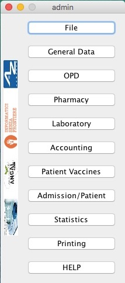
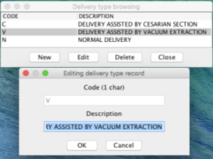
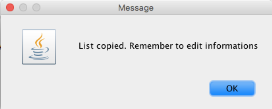
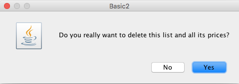
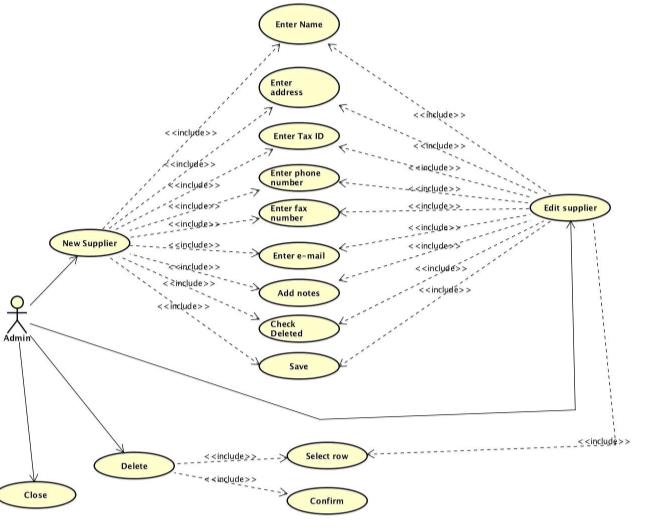
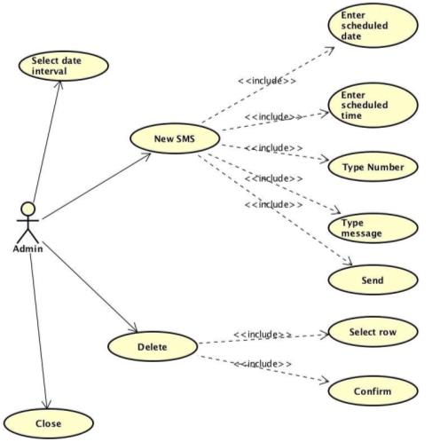
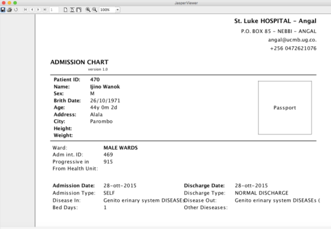

= OH 1.8.1 User Manual
:icons: font
:stem:
:toc: left
:toclevels: 4
:url-docs: https://asciidoctor.org/docs
:url-gem: https://rubygems.org/gems/asciidoctor

12/01/16

=== Intro: How to start OH

Start OH from a programming software, like Eclipse - the software used in this description. As the application is being loaded, a splash menu with the OH logo is shown. Then the login window appears: It has a dropdown menu with the user list, a password field, plus the “Submit” and the “Cancel” buttons. The administrator (admin, default password “admin”) can add and remove users, manage their passwords and privileges.

Once the user is logged in, OH shows the main menu, with all options granted for that user.

Considering the full administrator menu in the description of the entire OH system, there are 11 main options, plus the “Close” button to exit OH. Click on the “X” on the title bar, to log out and close the application.

* File: it has two options: “exit”, to log out as seen above, and “users”, to manage all OH users. The amministratore can create groups of users benefitting of the same set of rights. Click on “users” button to open a new sub-level with the “users” option to edit a single users’s settings and the “groups” option to manage user groups.
* General Data: it manages all data used by the OH database.
* OPD (Out Patient Department): this section allows the user to record, search, update and edit the patient's visits.
* Pharmacy: OH’s pharmacy records all items used by the hospital. This menu has three sub-levels: the “Pharmaceuticals” option to manage the pharmacy database, the “Pharmaceutical Stock” option to record movements between pharmacy and suppliers and the “Pharmaceutical Stock Ward” option to record movements within the hospital and its wards.
* Laboratory: this section allows the user to record, search and update the patient’s exams.
* Accounting: OH’s cash register records the bills generated from medical items and patient exams.
* Admission/Patient: this section allows the user to manager the patient database.
* Patient Vaccines: similar to the “Laboratory” menu, it records the patient’s vaccinations.
* Statistics: it generates Excel reports about the hospital activity on a given period of time.
* Printing: it generates a document with either the exams list or the diseases list, sorted by type.
* Help: it opens a .PDF file with the user’s guide.

== 1. Login

When starting OH for the first time, once it is being loaded, the main menu is immediately shown, as login is disabled. Open the project in Eclipse, click on triangles near the project name, the sub-folder “rsc” (below), and the file “generalData.properties”, containing all system settings. Row 3 shows by default the string “SINGLEUSER=yes”. Replacing “yes” with “no” on this string, the login window (on the bottom on the page) is

enabled. The user chooses his/her name from the dropdown menu with the user list, then enters the corresponding password. If username and password don’t match, an error window opens, showing the “password incorrect: retry”, message. Click OK to close this window and enable the login window again. If the password is correct, the user enters the OH system. The main menu is shown, with all the options granted for the given user.

The admin menu (left) has all

the options enabled, while a

guest menu (i.e., “Eduardo” menu, see also chapter 2.1.2) has a limited set of options. The administrator can edit all user’s privileges.

Data:

* user.US_ID_A (username)
* user.US_PASSWD (password)

== 2. File menu

The “File” menu contains two sub-menus: “exit”, to close OH, and “users”, where the administrator can manage user access to the system.

Focusing on “users” option and clicking on its button, the new window shows two options, “users” and “groups”. The former allows the administrator to manage a given user’s privileges, while the latter allows to create user groups.

=== 2.1 Users (editing a single user)

The “Users browser” shows the full list of signed users. When OH is opened for the first name, the list comprises of two users: the administrator, only person of the eponymous group, and a guest from the “guest” group (see chapter 1).

The bottom part of the menu disposes of some buttons to manage the table.

Data:

* user.US_ID_A (primary key, username)
* usergroup.UG_ID_A (foreign key referencing the user group)
* user.US_DESC (user description)

==== 2.1.1 Select group

Shows only users of the selected group. When the “Users browser” opens, the dropdown menu is set on “ALL”, and the full list is visible. Select the group from the menu, and the corrispondono row are automatically shown.

Data:

same of chapter 2.1

==== 2.1.2 New User

Adds a new OH user to the “user” database. Choose the user group from the dropdown menu, enter the username in the “Name” field, then type the password, retype it on the “Retype password” field, and add an optional description to help identify the user. Click “OK” to confirm, or “Cancel” to return to the users table. If “OK” was clicked and no password was inserted, an error window shows the “please insert a password” message. Click “OK” to return to “New User Record” window. If the two passwords don’t match, an error window shows the “password incorrect, please retype”. Click “OK” to return to “New User Record” and retype the passwords. If they match, the new user is added to the users table (top on next page).

Data:

all “user” attributes

==== 2.1.3 Edit user

Updates the user description. Select a row from the “Users browser” and click “Edit”. An “Editing user record” window opens. The “Description” field is freely editable. Click “OK” to save changes, or “Cancel” to return to the users menu.

If a row is not selected before clicking “Edit”, a “please select a row” window opens. Click “OK” to close the window to return to the user menu. This message will appear on every OH table, for all editing and deleting options.

Data:

* user.US_ID_A (primary key, username)
* user.US_DESC (user description)

==== 2.1.4 Reset Password

To change the password for a given user, select a row from the users browser and click “Reset Password”. Insert the new password on the new window (left).

Then click “OK”. Retype the new password on a second window similar to the first one and click “OK”.

If the passwords don’t match, an error message (left) is shown, else a confirmation window opens (right) and the new password is stored in the users DB (bottom window). Clicking “Cancel” anytime, the operation is aborted and there will be no changes to the users DB.

Data:

* user.US_ID_A (username)
* usergroup.UG_ID_A (password)

==== 2.1.5 Delete User

Removes the selected user from the user list. Select a row and click “Delete”. As in most “delete” operations, a confirmation window opens: click “Yes” to definitely remove the user from the list, or “No” to abort the operation.

Data:

* user.US_ID_A (primary key, username)

==== 2.1.6 Close Users browser

Closes the “Users browser” window. Click “Close” to return to the main menu.

=== 2.2 Groups (editing user groups)

The groups feature helps the administrator assign the same set of privileges to a multitude of users. A hospital likely has more than a single pharmacist, or surgeon, etc. , so it’s useful to aggregate users by their role in the hospital. The “Groups browser” window shows the name of the group, and a description. Default groups are “admin”, for the administrator(s), and “guest”, with read-only functions enabled. On the bottom side of the table, there are five buttons to manage the groups:

Data:

* usergroup.UG_ID_A (primary key, group name)
* usergroup.UG_DESC (group description)

==== 2.2.1 New Group

Creates a new user group. Click “New” on the “groups browser”. Add the name and an optional description in the new window, then click “OK” to confirm. If the name doesn’t exist in the “usergroup" database, the group will be added, else a “the group is already present” message appears. If no name is inserted, a “please insert a valid user group” message is shown.

Click “OK” after both unsuccessful cases to add a proper name. Once a valid name is entered, the new group is added to the “group browser” table (right).

Data:

both “usergroup” attributes

==== 2.2.2 Edit Group

Edits the group’s description. It’s similar to the “Edit User” option (2.1.3). Select a row, click “Edit” and type the (optional) description in the new window. Click “OK” to save changes, or “Cancel” to abort the operation.

Data:

both “usergroup” attributes

==== 2.2.3 Delete Group

Removes an existing group, except the “admin” and groups which have users assigned to.

Select a row from the “Group Browser” and click “Delete”. The confirmation window is shown: click “No” to abort the operation, or “Yes” to remove the group. If “admin” is selected, a “You can’t delete admin” message appears; if there are users belonging to the selected group, a “This group has users” window is shown. The “usergroup” database remains unchanged after both unsuccessful cases. For the latter case, first remove those users before deleting the group. Then create a new group (2.2.1) and add the users (2.1.2).

Data:

* usergroup.UG_ID_A (primary key, group name)
* user.US_UG_ID_A (foreign key referencing user group, to which the user belongs; if the selected group has users, it can’t be deleted)

==== 2.2.4 Group Menu

Allows the administrator, and all the users with this feature enabled, to manage privileges for every group in the “usergroup” database. Select a group from the “Group Browser” window and click “GroupMenu”. A new window “Menu Item Browser” (left), reproducing OH’s main menu, opens. Click on the triangles to expand the menu items. Enabled functions are shown in black, while disabled options are shown in light grey. Double click on a single option to activate/deactivate it. Click “Update” to save changes, or close the window to abort the operation.

As seen in chapter 1,

“Eduardo” can’t read the user menu (“HELP” option) by default. The administrator, or any user with permission to edit groups, selects the “guest” row, clicks “GroupMenu”, then double-clicks “HELP” on the “Menu Item

Browser” window (left) and clicks “Update”. Now Eduardo can access the user guide, as the menu pictured on the right shows the “HELP” button.

Data:

* groupmenu.GM_ID (primary key, option ID)
* groupmenu.GM_UG_ID_A (user)
* groupmenu.GM_MNI_ID_A (option name)
* groupmenu.GM_ACTIVE (Y if the option is enabled, else N)

==== 2.2.5 Close Groups Browser menu

Closes the “groups browser” window. Click “Close” to return to the main menu.

== 3. General Data menu

=== 3.1 Types

All data the hospital needs to work with - such as, medicals, exams, operations, diseases, etc. - are sorted by type. This menu shows users the list of categories for all data used in the OH databases. Users can define new types according to their needs.

OH’s categorized elements are:

* Admission type (the way the patient is admitted in the hospital)
* Discharge type: (the way the patient is dismissed from the hospital)
* Delivery type: (normal, caesarian, …)
* Delivery result type (childbirth’s

outcome)
* Disease type
* Exam type: il tipo di esame
* Medicals Stock movement type (charge, discharge, donation)
* Medicals type
* Operation type
* Pregnant treatment (treatments for pregnant mothers)
* Other prices (for extra services the hospital provides)
* Age type
* Vaccine type

All “Types” sub-menus, when clicked, open a window showing the list of the elements for the given type. There are “New”, “Edit” and “Delete” buttons to customize the tables, except for “Age Type”, having the “Edit” button only.

==== 3.1.1 Admission Type

The “Admission Type Browsing” table shows the different ways a patient is admitted in to the hospital. Default types are:

“A” (Ambulance, an ambulance carries the patient)

“R” (Referral, patient coming from another hospital / ward)

“I” (Self, patient coming by him/herself). Below is a screenshot from the “New Admission” option (8.5.1), where a dropdown menu is used to select admission types.

Data:

* admissiontype.ADMT_ID_A (primary key, admission type ID)
* admissiontype.ADMT_DESC (admission type description)

===== 3.1.1.1 New Admission Type

Click “New” on “Admission type browsing”. Enter a character code and a description on the “New admission type record” window, then click “OK” to confirm, or “Cancel” to abort the operation. Both elements are mandatory; if “OK” is clicked but almost one field is empty, either a “Please insert a code” or “Please insert a valid description” window is shown. If the code already exists, a “Code already in use” window opens. After all unsuccessful cases, click “OK” on the error window to return to the “New admission type record” panel.

Data:

both ”admissiontype” attributes (3.1.1)

===== 3.1.1.2 Edit Admission Type

image:extracted-media/media/image27.png[image,width=185,height=130]

Select a row from “Admission Type Browsing” and click “Edit”. The description field is freely editable. Click “OK” to save changes, or “Cancel” to abort the operation. If “OK” is clicked but the description field is empty, a “Please insert a valid description” window is shown. Click “OK” on the error window to return to the “Editing admission type record” panel.

Data:

both ”admissiontype” attributes (3.1.1)

===== 3.1.1.3 Delete admission type

Removes a row from the “admissiontype” database. Select a row from “Admission Type Browsing” and click “Delete”. Click “OK” on the confirmation window, or “Cancel” to abort the operation.

Data:

admissiontype.ADMT_ID_A

===== 3.1.1.4 Close Admission Type menu

Click “Close” on the “Admission Type Browsing” window to return to main menu.

==== 3.1.2 Discharge Type

The “Discharge type browsing” table defines the different ways a patient can be dismissed from the hospital. Default types are: “D” (Dead, patient deceased), “ES” (Escape, the patient escaped from the hospital), “EQ” (Normal Discharge), “B” (Referred, a further visit is planned for that patient).

Data:

* dischargetype.DIST_ID_A (primary key, discharge type ID)
* dischargetype.DIST_DESC (discharge type description)

===== 3.1.2.1 New Discharge Type

Click “New” on the “Discharge type browsing” table. Enter the character code and a description (used in the “New Discharge” option) on the “New Discharge Type Record” window. Click “OK” to confirm or “Cancel” to abort the operation. Both fields are mandatory; see 3.1.1.1 for error messages.

Data:

* dischargetype.DIST_ID_A (primary key, discharge type ID)
* dischargetype.DIST_DESC (discharge type description)

===== 3.1.2.2 Edit Discharge Type

Select a row from “Discharge Type Browsing” and click “Edit”. The description field is freely editable. Click “OK” to save changes, or “Cancel” to abort the operation. If “OK” is clicked but the description field is empty, a “Please insert a valid description” window is shown. Click “OK” on the error window to return to the “Editing discharge type record” panel.

Data:

* dischargetype.DIST_ID_A (primary key, discharge type ID)
* dischargetype.DIST_DESC (discharge type description)

===== 3.1.2.3 Delete Discharge Type

Removes a row from the “dischargetype” database. Select a row from “Discharge Type Browsing” and click “Delete”. Click “OK” on the confirmation window, or “Cancel” to abort the operation.

Data:

* dischargetype.DIST_ID_A (primary key, discharge type ID)

===== 3.1.2.4 Discharge Type menu

Click “Close” on the “Discharge Type Browsing” window to return to main menu.

==== 3.1.3 Delivery Type

The “Delivery type browsing” table defines the ways of assisting pregnant mothers in the event of a delivery. Default types are: “C” (Caesarian delivery), “V” (Vacuum extraction), “N” (No assistance).

Data:

* deliverytype.DRT_ID_A (primary key, delivery type ID)
* deliverytype.DRT_DESC (delivery type ID)

===== 3.1.3.1 New Delivery Type

Click “New” on the “Delivery type browsing” table. Enter the one-character code and a description on the “New Delivery Type Record” window. Click “OK” to confirm or “Cancel” to abort the operation. Both fields are mandatory; see 3.1.1.1 for error messages.

Data:

* deliverytype.DRT_ID_A (primary key, delivery type ID)
* deliverytype.DRT_DESC (delivery type ID)

===== 3.1.3.2 Edit Delivery Type

Select a row from “Delivery Type Browsing” and click “Edit”. The description field is freely editable. Click “OK” to save changes, or “Cancel” to abort the operation. If “OK” is clicked but the description field is empty, a “Please insert a valid description” window is shown. Click “OK” on the error window to return to the “Editing delivery type record” panel.

Data:

* deliverytype.DRT_ID_A (primary key, delivery type ID)
* deliverytype.DRT_DESC (delivery type ID)

===== 3.1.3.3 Delete Delivery Type

Removes a row from the “deliverytype” database. Select a row from “Delivery Type Browsing” and click “Delete”. Click “OK” on the confirmation window, or “Cancel” to abort the operation.

Data:

* deliverytype.DRT_ID_A (primary key, delivery type ID)

===== 3.1.3.4 Close Delivery Type menu

Click “Close” on the “Delivery Type Browsing” window to return to the main menu.

==== 3.1.4 Delivery Result Type

image:extracted-media/media/image35.jpeg[image,width=453,height=192]

The “Delivery result type browsing” table defines the different delivery outcomes. Default types are shown below:

Data:

* deliveryresulttype.DRT_ID_A (primary key, delivery result type ID)
* deliveryresulttype.DRT_DESC (delivery result type description)

===== 3.1.4.1 New Delivery Result Type

Click “New” on the “Delivery result type browsing” table. Enter the one-character code and a description on the “New Delivery Result Type Record” window. Click “OK” to confirm or “Cancel” to abort the operation. Both fields are mandatory; see 3.1.1.1 for error messages.

Data:

* deliveryresulttype.DRT_ID_A (primary key, delivery result type ID)
* deliveryresulttype.DRT_DESC (delivery result type description)

===== 3.1.4.2 Edit Delivery Result Type

Select a row from “Delivery Result Type Browsing” and click “Edit”. The description field is freely editable. Click “OK” to save changes, or “Cancel” to abort the operation. If “OK” is clicked but the description field is empty, a “Please insert a valid description” window is shown. Click “OK” on the error window to return to the “Editing delivery result type record” panel.

Data:

* deliveryresulttype.DRT_ID_A (primary key, delivery result type ID)
* deliveryresulttype.DRT_DESC (delivery result type description)

===== 3.1.4.3 Delete Delivery Result Type

Removes a row from the “deliveryresulttype” database. Select a row from “Delivery Result Type Browsing” and click “Delete”. Click “OK” on the confirmation window, or “Cancel” to abort the operation.

Data:

* deliveryresulttype.DRT_ID_A (primary key, delivery result type ID)

===== 3.1.4.4 Close Delivery Result Type menu

Click “Close” on the “Delivery Result Type Browsing” window to return to the main menu.

==== 3.1.5 Disease Type

The table “Disease type browsing” defines the different disease categories used in OH, including “OPD”. Default types: “ND” (Notifiable diseases), “OC” (Infective diseases), “MP” (Maternal / perinatal diseases), “NC” (Non communicable diseases), “AO” (All other diseases).

Data:

* diseasetype.DCL_ID_A (primary key, disease type ID)
* diseasetype.DCL_DESC (disease type description)

===== 3.1.5.1 New Disease Type

Click “New” on the “Disease type browsing” table. Enter the character code and a description on the “New Disease Type Record” window. Click “OK” to confirm or “Cancel” to abort the operation. Both fields are mandatory; see 3.1.1.1 for error messages.

Data:

* diseasetype.DCL_ID_A (primary key, disease type ID)
* diseasetype.DCL_DESC (disease type description)

===== 3.1.5.2 Edit Disease Type

Select a row from “Disease Type Browsing” and click “Edit”. The description field is freely editable. Click “OK” to save changes, or “Cancel” to abort the operation. If “OK” is clicked but the description field is empty, a “Please insert a valid description” window is shown. Click “OK” on the error window to return to the “Editing disease type record” panel.

Data:

* diseasetype.DCL_ID_A (primary key, disease type ID)
* diseasetype.DCL_DESC (disease type description)

===== 3.1.5.3 Delete Disease Type

Removes a row from the “diseasetype” database. Select a row from “Disease Type Browsing” and click “Delete”. Click “OK” on the confirmation window, or “Cancel” to abort the operation.

Data:

* diseasetype.DCL_ID_A (primary key, disease type ID)

===== 3.1.5.4 Close Disease Type menu

Click “Close” on the “Disease Type Browsing” window to return to the main menu.

==== 3.1.6 Exam Type

The “Exam Type Browsing” table defines the different exam categories used in OH, including “Laboratory”. Default types are shown below:

Data:

* examtype.EXC_ID_A (primary key, exam type ID)
* examtype.EXC_DESC (exam type description)

===== 3.1.6.1 New Exam Type

Click “New” on the “Exam type browsing” table. Enter the character code and a description on the “New Exam Type Record” window. Click “OK” to confirm or “Cancel” to abort the operation. Both fields are mandatory; see 3.1.1.1 for error messages.

Data:

* examtype.EXC_ID_A (primary key, exam type ID)
* examtype.EXC_DESC (exam type description)

===== 3.1.6.2 Edit Exam Type

Select a row from “Exam Type Browsing” and click “Edit”. The description field is freely editable. Click “OK” to save changes, or “Cancel” to abort the operation. If “OK” is clicked but the description field is empty, a “Please insert a valid description” window is shown. Click “OK” on the error window to return to the “Editing exam type” panel.

Data:

* examtype.EXC_ID_A (primary key, exam type ID)
* examtype.EXC_DESC (exam type description)

===== 3.1.6.3 Delete Exam Type

Removes a row from the “examtype” database. Select a row from “Exam Type Browsing” and click “Delete”. Click “OK” on the confirmation window, or “Cancel” to abort the operation.

Data:

* examtype.EXC_ID_A (primary key, exam type ID)

===== 3.1.6.4 Close Exam Type Menu

Click “Close” on the “Exam Type Browsing” window to return to the main menu.

==== 3.1.7 Medical Stock Movement Type

The “Medicals Stock Movement Type Browsing” table shows the different money movements involving the hospital. The two basic elements (below) are: “Charge”, for incomes (+), and “Discharge”, for payments (-).

Data:

* medicaldsrstockmovtype.MMVT_ID_A (primary key, movement type ID)
* medicaldsrstockmovtype.MMVT_ID_DESC (movement type description)
* medicaldsrstockmovtype.MMVT_ID_A (“+” or “-“)

===== 3.1.7.1 New Medical Stock Movement Type

Click “New” on the “Medicals Stock Movement Type Browsing” window. Enter a character code, a description (i.e. the name of the movement) and select the type (income or outcome) from

the dropdown menu. Click “OK” to confirm or “Cancel” to abort the operation. Both fields are mandatory; see 3.1.1.1 for error messages. Pictured left is an example, where a “donation” category is added to the “medicaldsrstockmovtype” database (right).

Data:

see chapter 3.1.7

===== 3.1.7.2 Edit Medical Stock Movement Type

Select a row from “Medicals Stock Movement Type Browsing” and click “Edit”. The description field is freely editable. Click “OK” to save changes, or “Cancel” to abort the operation. If “OK” is clicked but the description field is empty, a “Please insert a valid description” window is shown. Click “OK” on the error window to return to the “Editing exam type” panel.

Data:

* medicaldsrstockmovtype.MMVT_ID_A (primary key, movement type ID)
* medicaldsrstockmovtype.MMVT_ID_DESC (movement type description)

===== 3.1.7.3 Delete Medical Stock Movement Type

Removes a row from the “medicaldsrstockmovtype” database. Select a row from “Medicals Stock Movement Type Browsing” and click “Delete”. Click “OK” on the confirmation window, or “Cancel” to abort the operation.

Data:

* medicaldsrstockmovtype.MMVT_ID_A (primary key, movement type ID)

===== 3.1.7.4 Close Medical Stock Movement Type menu

Click “Close” on the “Medical Stock Movement Type Browsing” window to return to main menu.

==== 3.1.8 Medical Type

The “Medical Type Browsing” table defines the different categories for medicals and other items used by the hospital. Default types are shown below.

Data:

* medicaldsrtype.MMVT_ID_A (primary key, medical type ID)
* medicaldsrtype.MMVT_ID_DESC (medical type description)

===== 3.1.8.1 New Medical Type

image:extracted-media/media/image54.png[image,width=286,height=147]

Click “New” on the “Medical Type Browsing” window. Enter a one-character code and a description (i.e. the name of the item). Click “OK” to confirm or “Cancel” to abort the operation. Both fields are mandatory; see 3.1.1.1 for error messages.

Data:

* medicaldsrtype.MMVT_ID_A (primary key, medical type ID)
* medicaldsrtype.MMVT_ID_DESC (medical type description)

===== 3.1.8.2 Edit Medical Type

Select a row from “Medical Type Browsing” and click “Edit”. The description field is freely editable. Click “OK” to save changes, or “Cancel” to abort the operation. If “OK” is clicked but the description field is empty, a “Please insert a valid description” window is shown. Click “OK” on the error window to return to the “Editing Medical type” panel.

Data:

* medicaldsrtype.MMVT_ID_A (primary key, medical type ID)
* medicaldsrtype.MMVT_ID_DESC (medical type description)

===== 3.1.8.3 Delete Medical Type

Removes a row from the “medicaldsrtype” database. Select a row from “Medicals Type Browsing” and click “Delete”. Click “OK” on the confirmation window, or “Cancel” to abort the operation.

Data:

* medicaldsrtype.MMVT_ID_A (primary key, medical type ID)

===== 3.1.8.4 Close Medical Type Menu

Click “Close” on the “Medical Type Browsing” window to return to main menu.

==== 3.1.9 Operation Type

The “Operation Type Browsing” table defines the operation categories. Default types are shown below:

Data:

* operationtype.OCL_ID_A (primary key, operation type ID)
* operationtype.OCL_DESC (operation type description)
* operationtype.OCL_TYPE (operation status, can be “MAJOR” or “MINOR”; currently unused)

===== 3.1.9.1 New Operation Type

Click “New” on the “Operation Type Browsing” window. Enter a character code and a description (i.e. the name of the operation). Click “OK” to confirm or “Cancel” to abort the operation. Both fields are mandatory; see 3.1.1.1 for error messages.

Data:

* operationtype.OCL_ID_A (primary key, operation type ID)
* operationtype.OCL_DESC (operation type description)

===== 3.1.9.2 Edit Operation Type

Select a row from “Operation Type Browsing” and click “Edit”. The description field is freely editable. Click “OK” to save changes, or “Cancel” to abort the operation. If “OK” is clicked but the description field is empty, a “Please insert a valid description” window is shown. Click “OK” on the error window to return to the “Editing Medical type” panel.

Data:

* operationtype.OCL_ID_A (primary key, operation type ID)
* operationtype.OCL_DESC (operation type description)

===== 3.1.9.3 Delete Operation Type

Removes a row from the “operationtype” database. Select a row from “Operation Type Browsing” and click “Delete”. Click “OK” on the confirmation window, or “Cancel” to abort the operation.

Data:

* operationtype.OCL_ID_A (primary key, operation type ID)

===== 3.1.9.4 Close Operation Type Menu

Click “Close” on the “Operation Type Browsing” window to return to the main menu.

==== 3.1.10 Pregnant Treatment Type

The “Pregnant Treatment Type Browsing” table defines the types of treatments to pregnant mothers. Default types are shown below:

Data:

* pregnanttreatmenttype.PTT_ID_A (primary key, pregnant treatment type ID)
* pregnanttreatmenttype.DESC(pregnant treatment type description)

===== 3.1.10.1 New Pregnant Treatment Type

Click “New” on the “Operation Type Browsing” window. Enter a character code and a description (i.e. the name of the treatment). Click “OK” to confirm or “Cancel” to abort the operation. Both fields are mandatory; see 3.1.1.1 for error messages.

Data:

* pregnanttreatmenttype.PTT_ID_A (primary key, pregnant treatment type ID)
* pregnanttreatmenttype.DESC(pregnant treatment type description)

===== 3.1.10.2 Edit Pregnant Treatment Type

Select a row from “Pregnant Treatment Type Browsing” and click “Edit”. The description field is freely editable. Click “OK” to save changes, or “Cancel” to abort the operation. If “OK” is clicked but the description field is empty, a “Please insert a valid description” window is shown. Click “OK” on the error window to return to the “Editing Pregnant Treatment type” panel.

Data:

* pregnanttreatmenttype.PTT_ID_A (primary key, pregnant treatment type ID)
* pregnanttreatmenttype.PTT_DESC(pregnant treatment type description)

===== 3.1.10.3 Delete Pregnant Treatment Type

Removes a row from the “pregnanttreatmenttype” database. Select a row from “Pregnant Treatment Type Browsing” and click “Delete”. Click “OK” on the confirmation window, or “Cancel” to abort the operation.

Data:

* pregnanttreatmenttype.PTT_ID_A (primary key, pregnant treatment type ID)

===== 3.1.10.4 Close Pregnant Treatment menu

Click “Close” on the “Pregnant Treatment Type Browsing” window to return to the main menu.

==== 3.1.11 Other Prices

Defines specific prices lists, which will be stored in a separate “pricesothers” database.

===== 3.1.11.1 New List

Click “New” on the “Other Prices Browser” (top left). A “New Price” window opens. Enter a code and a description (both mandatory). Click “OK” to confirm. If data are correct, the list is added, else a “Please insert a code /

description” window is shown. Click “OK” to return to the former window.

Data:

* pricesothers.OTH_ID (primary key, list ID, auto-increment)
* pricesothers.OTH_CODE (list code)
* pricesothers.OTH_CODE (list description)

===== 3.1.11.2 Edit List

Select a list from the browser and click “Edit”. An “Edit Price” window opens (identical to the “New Price” in 3.1.11.1). Both code and description are editable. Click “OK” to save changes or “Cancel” to abort. If data are correct, the list will be updated.

Data: see chapter 3.1.11.2

===== 3.1.11.3 Delete List

Select a list from the browser and click “Delete”. Then click “OK” on the confirmation window to remove the list from the “pricesothers” DB, or “Cancel” to abort.

Data:

pricesothers.OTH_ID

===== 3.1.11.4 Close Other Prices menu

Click “Close” on the “Other prices browser” to return to OH’s main menu.

==== 3.1.12 Age Type

When a patient is register in OH’s “patient” database, it’s not always possible to determine his/her age, since the birthdate is unknown. In this case, the user can choose the age interval from a dropdown menu in the “New Patient” option. The “Age type browsing“ table below defines the age ranges. Every row determines, respectively, the code of the interval, the minimum age, the maximum age, and the description of the range.

Data:

* agetype.AT_CODE (primary key, age type ID)
* agetype.AT_FROM (minimum age)
* agetype.AT_TO (maximum age)
* agetype.AT_DESC (description of the range)

===== 3.1.12.1 Edit Age Type

Select a row from “Age Type Browsing” and click “Edit”. The description field is freely editable. Click “OK” to save changes, or “Cancel” to abort the operation.

Data:

* agetype.AT_CODE (primary key, age type ID)
* agetype.AT_DESC (description of the range)

===== 3.1.12.2 Close Age type menu

Click “Close” on the “Age Type Browsing” window to return to the main menu.

==== 3.1.13 Vaccine Type

The “Vaccine Type Browsing” table defines all vaccine types. Default categories are:

* C (Vaccines for children)
* P (Vaccines for pregnant women)
* N (Vaccines for adults, except pregnant women)

Data:

* vaccinetype.VACT_ID_A (primary key, vaccine type ID)
* vaccinetype.VACT_DESC (vaccine type description)

===== 3.1.13.1 New Vaccine Type

Click “New” on the “Vaccine Type Browsing” window. Enter a one-character code and a description (i.e. the name of the treatment). Click “OK” to confirm or “Cancel” to abort the operation. Both fields are mandatory; see 3.1.1.1 for error messages.

Data:

* vaccinetype.VACT_ID_A (primary key, vaccine type ID)
* vaccinetype.VACT_DESC (vaccine type description)

===== 3.1.13.2 Edit Vaccine Type

Select a row from “Vaccine Type Browsing” and click “Edit”. The description field is freely editable. Click “OK” to save changes, or “Cancel” to abort the operation. If “OK” is clicked but the description field is empty, a “Please insert a valid description” window is shown. Click “OK” on the error window to return to the “Edit vaccine type” panel.

Data:

* vaccinetype.VACT_ID_A (primary key, vaccine type ID)
* vaccinetype.VACT_DESC (vaccine type description)

===== 3.1.13.3 Delete Vaccine Type

Removes a row from the “vaccinetype” database. Select a row from “Vaccine Type Browsing” and click “Delete”. Click “OK” on the confirmation window, or “Cancel” to abort the operation.

Data:

* vaccinetype.VACT_ID_A (chiave primaria, identificativo del tipo di vaccino)

===== 3.1.13.4 Close Vaccine type menu

Click “Close” on the “Vaccine Type Browsing” window to return to the main menu.

=== 3.2 Hospital

Hospital location data are automatically printed on reports generated by some OH functions, such as “Pharmacy -> Pharmaceuticals” or “Accounting -> Bills Manager”.

When the “Hospital Informations” window opens, only the “Edit” and “Close” buttons are enabled, and information is not editable. Click “Edit” to update the text fields, then “Update” to save

changes and “Close” to close the window and return to the main menu.

Data:

hospital.HOS_NAME (name)

hospital.HOS_ADDR (address)

hospital.HOS_CITY (city)

hospital.HOS_TELE (phone number)

hospital.HOS_FAX (fax number)

hospital.HOS_EMAIL (e-mail)

hospital.HOS_CURR_COD (hospital’s currency code)

=== 3.3 Ward

The “Ward” section allows the administrator to manage hospital wards. Here are the mandatory attributes for every ward, shown in the “Wards browser” table:

* ward code, a character ID
* ward name
* number of beds
* number of doctors
* number of nurses
* “has pharmacy”, (1 if the ward can access to pharmacy in the “Pharmacy -> P.S. Ward” menu, else 0);
* “male”/“female”, boolean values to identify wards accessible to men and/or women.

Optional attributes include phone number, fax number, e-mail address.

Data:

ward.WRD_ID (primary key, ward ID)

ward.WRD_NAME (ward name)

ward.WRD_TELE (phone number)

ward.WRD_FAX (fax number)

ward.WRD_EMAIL (e-mail)

ward.WRD_NBEDS (number of beds)

ward.WRD_NQUA_NURS (number of nurses)

ward.WRD_NDOC (number of doctors)

ward.WRD_IS_PHARMACY (1 if the ward has its own pharmacy, else 0)

ward.WRD_IS_MALE (1 if men are allowed, else 0)

ward.WRD_IS_FEMALE (1 if women are allowed, else 0)

==== 3.3.1 New Ward

Adds a new ward in the hospital. Click “New” in the “Wards browser”. A “New ward record” window opens. Fill the mandatory text fields, marked with the * sign, and add phone, fax and e-mail contacts if necessary. Tick the “ward with pharmacy” checkbox if the ward will have its own pharmacy; do the same on “male ward” if it’ll be allowed to men, and on “female ward” if women can access in it. Click “OK” to confirm or “Cancel” to abort the operation. If all data required are correct, the ward will be added to the “ward” database, else an error window is shown:

* “Code already in use”
* “Please insert a code” (if the code character has not been added)
* “Insert a valid beds/nurses/doctors/ number” (if a non-numeric value has been added).

After all unsuccessful cases click “OK” to return to the “New ward record” window.

Data:

see chapter 3.3

==== 3.3.2 Edit Ward

Select a row form “Wards Browser” and click “Edit”. An “Editing ward record” window opens; all elements except the code are editable. Once changes have been made, click “OK” to confirm or “Cancel” to abort the operation. If all data required are correct, the ward will be updated in the “ward” database, else an error window is shown (see 3.3.1).

Data:

see chapter 3.3

==== 3.3.3 Delete Ward

Removes a ward from the “ward” database, if it has no patients registered in the “Admission/Patient” menu. Select a row form “Wards Browser” and click “Delete”. Click “OK” on the confirmation window, or “Cancel” to abort the operation.

If there’s at least one patient admitted in the selected ward, there will be no deletion and a “Selected ward has X patients” window is shown. Pictured left is the example of the children ward, that has 123 patients registered.

Here is a screenshot from the “Admission/Patient” window, where 7 of the 123 patients from the children ward are visible (codes from 474 to 482). All patients from a ward must be discharged before removing it.

Data:

* ward.WRD_ID (primary key, ward ID)
* admission.WRD_ID_A (foreign key referencing to “ward”, to check if there are admitting patients in the selected ward)

==== 3.3.4 Close Ward menu

Click “Close” on the “Wards Browser” window to return to the main menu.

=== 3.4 Disease

The “Diseases browser” table contains all diseases registered in the “disease” database. Every row shows the disease code, the type (3.1.5) and the disease name.

Data:

* disease.DIS_ID_A (primary key, disease ID)
* disease.DIS_DCL_ID_A (foreign key referencing to “diseasetype”)
* disease.DIS_DESC (disease name)

==== 3.4.1 Select Disease Type

To help search a disease, click the dropdown menu on the bottom of the “Diseases Browser” window, and select a type, or “ALL” to visualize all records.

Data:

* disease.DIS_ID_A (primary key, disease ID)
* disease.DIS_DCL_ID_A (foreign key referencing to “diseasetype”)

==== 3.4.2 New Disease

Adds a new disease to the “disease” database. Click “New” on the “Diseases browser” window. A “New disease” window opens. Select the type from the dropdown menu, enter a code and the description (i.e. the name of the disease, used in “OPD” and “Diagnosis IN” / “Diagnosis OUT” lists of the “Admission/Patient” menu). Then tick at least one checkbox to assign the disease to “OPD” (OutPatient

Dept.), “IPD IN” (“Diagnosis IN”) and “IPD OUT” (“Diagnosis OUT”). Click “OK” to confirm or “Cancel” to abort the operation. If all data required are correct, the disease will be added to the “disease” database, else an error window is shown:

* “Code already in use”
* “Please insert a code” (if the code character has not been added)
* “Insert a valid description” (if the description has not been added).

After all unsuccessful cases click “OK” to return to the “New disease” window.

Data:

* disease.DIS_ID_A (primary key, disease ID)
* disease.DIS_DCL_ID_A (foreign key referencing to “diseasetype”)
* disease.DIS_DESC (disease name)
* disease.DIS_OPD_INCLUDE (1 if the disease is included in the “OPD” list, else 0)
* disease.DIS_IPD_IN_INCLUDE (1 if the disease is included in the “IPD IN” list, else 0)
* disease.DIS_IPD_OUT_INCLUDE (1 if the disease is included in the “IPD OUT” list, else 0)

==== 3.4.3 Edit Disease

Select a row from “Diseases Browser” and click “Edit”. An “Edit disease” window opens; all elements except the code are editable. Once changes have been made, click “OK” to confirm or “Cancel” to abort the operation. If all data required are correct, the disease will be updated in its database, else an error window is shown (see 3.4.2).

Data:

see chapter 3.4.2

==== 3.4.4 Delete Disease

Removes a disease from its database. Select a row from “Diseases browser” and click “Delete”. Click “OK” on the confirmation window, or “Cancel” to abort the operation.

Data:

* disease.DIS_ID_A (primary key, disease ID)

==== 3.4.5 Close Disease menu

Click “Close” on the “Diseases Browser” window to return to the main menu.

=== 3.5 Exams

The “Exams browsing” table defines all exams recorded in the “exam” database and used in “Laboratory”, “Accounting -> New Bill” and “Printing -> Exams List” menus. Every row shows the exam code, the exam type (3.1.6), its description, the procedure applied (“1” or “2”) and the default result (3.5.5).

Data:

* exam.EXA_ID_A (primary key, exam ID)
* exam.EXA_EXC_ID_A (foreign key referencing “examtype”, exam type)
* exam.EXA_DESC (exam name)
* exam.EXA_PROC (exam procedure, “1” or “2”)
* exam.EXA_DEFAULT (default result)

==== 3.5.1 Select Exam type

To help search an exam, click the dropdown menu on the bottom of the “Exams Browsing” window, and select a type, or “ALL” to visualize all records.

Data:

* exam.EXA_ID_A (primary key, exam ID)
* exam.EXA_EXC_ID_A (foreign key referencing “examtype”, exam type)

==== 3.5.2 New Exam

image:extracted-media/media/image88.png[image,width=273,height=192]

Click “New” on the “Exams Browsing” window. A “New exam” window opens. Select the exam type from the first dropdown menu, enter the code, a description (i.e. the name of the exam), select the procedure type and enter the default result. Click “OK” to confirm or “Cancel” to abort the operation. If all data required are correct, the exam will be added to the “exam” database, else an error window is shown:

* “Change the code because is already in use”
* “Insert a valid code and/or description”

After all unsuccessful cases click “OK” to return to the “New exam” window.

Data:

see chapter 3.5

==== 3.5.3 Edit Exam

Select a row from “Exams Browsing” and click “Edit”. An “Edit exam” window opens; only the description and default result are editable. Once changes have been made, click “OK” to confirm or “Cancel” to abort the operation. If all data required are correct, the exam will be updated in its database, else an error window is shown (see 3.5.2).

Data:

* exam.EXA_ID_A (primary key, exam ID)
* exam.EXA_DESC (exam name)
* exam.EXA_DEFAULT (default result)

==== 3.5.4 Delete Exam

Removes a exam from its database. Select a row from “Exams browsing” and click “Delete”. Click “OK” on the confirmation window, or “Cancel” to abort the operation.

Data:

* exam.EXA_ID_A (primary key, exam ID)

==== 3.5.5 Exam result

Every exam has a set of possible results (for example: positive / negative). The outcome of an exam is reported in the “Laboratory browsing” table, pictured left (see also chapter 6).

OH allows to manage the set of results for every recorded exam. Select a row from the “Exam Browsing” window and click “Result”. A new window shows a table with all outcomes, each with a code and a description. Here is an example of the “SUGAR” glucose exam (highlighted in the table at chapter 3.5).

To add a new result, click “New”, enter the description, then click “OK” to confirm or “Cancel” to abort the operation. Considering the example shown above, a “Very Low” level is added to “High”, “Low” and “Normal”.

The “Sugar results” table is updated with the new row (the code is automatically generated since it’s an auto-increment integer).

To remove a result, click “Delete” then click “OK” on the confirmation window, or “Cancel” to abort the operation.

To close the results table, click “Close” to return to the “Exams browsing” table.

Data:

* exam.EXA_ID_A (exam ID)
* examrow.EXR_ID (primary key, result ID)
* examrow.EXR_EXA_ID_A (foreign key referencing to exam.EXA_ID_A)
* examrow.EXR_DESC (result description)

==== 3.5.6 Close Exams menu

Click “Close” on the “Exam Browsing” window to return to the main menu.

=== 3.6 Operation

The “Operations browser” table defines all operations recorded in the “operation” database. Every row shows the operation code, the operation type (3.1.9) and its description.

Data:

* operation.OPE_ID_A (primary key, operation ID)
* operationtype.OCL_ID_A (foreign key referencing “operation”, operation type)
* operation.OPE_DESC (operation name)

==== 3.6.1 Select operation type

To help search an operation, click the dropdown menu on the bottom of the “Operations browser” window, and select a type, or “ALL” to visualize all records.

Data:

* operation.OPE_ID_A (primary key, operation ID)
* operationtype.OCL_ID_A (foreign key referencing “operation”, operation type)

==== 3.6.2 New Operation

Click “New” on the “Operations Browser” window. A “New operation record” window opens. Select the operation type from the first menu, enter the code, a description (i.e. the name of the operation). Status - major or minor - is currently unused in OH, however the user can choose it with the radio buttons. Click “OK” to confirm or “Cancel” to close the window without saving data inserted. If all data required are correct, the operation will be added to the “operation” database, else an error window is shown:

* “Code already in use”
* “Please insert a valid description”
* “Operation already present” (if there’s one with the same description).

After all unsuccessful cases click “OK” to return to the “New operation record” window.

Data:

* operation.OPE_ID_A (primary key, operation ID)
* operationtype.OCL_ID_A (foreign key referencing “operation”, operation type)
* operation.OPE_DESC (operation name)
* operation.OPE_STAT (operation status, “MAJOR” or “MINOR”, currently unused)

==== 3.6.3 Edit Operation

Select a row from “Operations Browser” and click “Edit”. An “Editing operation record” window opens; only description and status are editable. Once changes have been made, click “OK” to confirm or “Cancel” to return to close the window without saving changes. If data required are correct, the operation will be updated in its database, else an error window is shown (see 3.6.2).

Data:

* operation.OPE_ID_A (primary key, operation ID)
* operation.OPE_DESC (operation name)
* operation.OPE_STAT (operation status, “MAJOR” or “MINOR”, currently unused)

==== 3.6.4 Delete Operation

Removes an operation from its database. Select a row from “Operations browser” and click “Delete”. Click “OK” on the confirmation window, or “Cancel” to abort the deletion.

Data:

* operation.OPE_ID_A (primary key, operation ID)

==== 3.6.5 Close Operation menu

Click Close” on the “Operations browsing” window to return to the main menu.

=== 3.7 Vaccine

The “Vaccine browser” table defines all vaccines recorded in the “vaccine” database. Every row shows the code ID, the vaccine type (3.1.13) and its description.

Data:

* vaccine.VAC_ID_A (primary key, vaccine ID)
* vaccine.VAC_VACT_ID_A (foreign key referencing “vaccinetype” database)
* vaccine.VAC_DESC (vaccine description)

==== 3.7.1 Select Vaccine Type

To help search a vaccine, click the dropdown menu on the bottom of the “Operations browser” window, and select a type, or “ALL” to visualize all records.

Data:

* vaccine.VAC_ID_A (primary key, vaccine ID)
* vaccine.VAC_VACT_ID_A (foreign key referencing “vaccinetype” database)

==== 3.7.2 New Vaccine

Click “New” on the “Vaccine Browser” window. A “New vaccine record” window opens. Select the vaccine type from the dropdown menu, enter the code and description (i.e. the name of the vaccine). Click “OK” to confirm or “Cancel” to abort the operation. If all data required are correct, the vaccine will be added to the “vaccine” database, else an error window is shown:

* “Code already in use”
* “Please insert a code/description”

After both unsuccessful cases click “OK” to return to the “New vaccine record” window.

Data:

* see chapter 3.7

==== 3.7.3 Edit Vaccine

Select a row from “Vaccine Browser” and click “Edit”. An “Editing vaccine record” window opens; only the description field is editable. Once changes have been made, click “OK” to confirm or “Cancel” to return to close the window without saving changes. If data required are correct, the operation will be updated in its database, else an error window is shown (see 3.7.2).

Data:

* vaccine.VAC_ID_A (primary key, vaccine ID)
* vaccine.VAC_DESC (vaccine description)

==== 3.7.4 Delete Vaccine

Removes a vaccine from its database. Select a row from “Vaccine browser” and click “Delete”. Click “OK” on the confirmation window, or “Cancel” to abort the deletion.

Data:

* vaccine.VAC_ID_A (primary key, vaccine ID)

==== 3.7.5 Close Vaccine menu

Click “Close” on the “Vaccine browser” window to return to the main menu.

=== 3.8 Prices Lists

The “Price Lists” menu allows the administrator to manage pricing for medicals, exams and operations, creating customized price lists for different users. “The Prices Browser” window (below) shows all elements for a single list, sorted in “Exams”, “Operations”, “Medicals” and “Others” folders. Click on tre triangle next to each folder to expand its content.

Data (for every item of the list):

* prices.PRC_ID (primary key, item - price list pair)

* prices.PRC_LST_ID (foreign key referencing to the “pricelists” database)
* prices.PRC_GRP (item category)
* prices.PRC_ITEM (item ID)
* prices.PRC_DESC (item description)
* prices.PRC_PRICE (item price)

Data (for price lists):

* pricelists.LST_ID (primary key, price list ID)
* pricelists.LST_CODE (price list code)
* pricelists.LST_NAME (price list name)
* pricelists.LST_DESC (price list description)
* pricelists.LST_CURRENCY (currency used in the list)

==== 3.8.1 Choose List

The “Prices Browser” window has a dropdown menu on the top, to choose

between the lists created with the “Manage List” option (3.8.2). Every time the user switches to a different list, a confirmation window (right) is shown. Click “OK” to confirm, or Cancel to return to the current list.

Data:

* pricelists.LST_ID
* pricelists.LST_CODE

==== 3.8.2 Manage Lists

Click the “Manager Lists” button on the right top of the “Prices browser” window. A “List browser” window opens. It has a table with the list records, showing the code, the name, the description and the currency used.

Some buttons on the bottom allow to create, edit and delete lists.

Data:

* pricelists.LST_ID (primary key, not shown in the table)
* pricelists.LST_CODE (price list code)
* pricelists.LST_NAME (price list name)
* pricelists.LST_DESC (price list description)
* pricelists.LST_CURRENCY (currency used in the list)

===== 3.8.2.1 New List

Click “New” on the “List Browser” window. Enter the code, the name, the description and the currency used in the list.

Click “OK” to confirm or “Cancel” to abort the operation. If all data have been added, the list will be added to the “pricelists” database, else a “Please insert a code/name/description/currency” is shown, depending of the field(s) left empty. In this case, click “OK” to return to the “New List” window.

Data: see chapter 3.8.2

===== 3.8.2.2 Copy List

This option creates a copy of the list selected, with prices multiplied by a given factor. Select the list from the “List Browser” table and click “Copy”. A sequence of 4 panels opens.

image:extracted-media/media/image109.png[image,width=174,height=93]

Enter the name of the new list in the first window. Click “OK” and enter the multiplying factor in the second panel; Click “OK” and enter the rounding factor. Multiplied prices will be rounding to the next higher multiple of the value inserted. After clicking “OK”, a “List Copied” message window is shown. Click “OK” to close it, and the list will be added to the “priceslists” database.

Data:

see chapter 3.8.2

===== 3.8.2.3 Edit List

Select a row from “List browser” and click “Edit”. The “Edit List” window opens. All data are freely editable. Click “OK to confirm or “Cancel” to abort the operation. If all data have been added, the list will be updated, else an error window is shown (3.8.2.1).

Data :

see chapter 3.8.2

===== 3.8.2.4 Delete List

Removes a price list from its database. Select a row from “List browser” and click “Delete”. Click “OK” on the confirmation window (left), or “Cancel” to abort the deletion.

Data:

* pricelists.LST_ID

===== 3.8.2.5 Close List Browser

Click “Close” on the “List Browser” window to return to OH’s main menu.

==== 3.8.3 Save List

After editing the items within a price list, changes must be saved before closing the “Prices browser” window. Click the “SAVE” button and then “OK” on the confirmation window (left). To discard changes, click “Cancel”.

==== 3.8.4 Print List

Generates a report containing the rows of the selected list. Click “Print” on the “Prices Browser” window. The Jasper Viewer opens; it has some buttons (below) to save in .PDF, print, update, scroll the pages, fit the document to the computer screen and zoom.

==== 3.8.5 Close Price Lists menu

Click “Close” on the “Prices Browser” menu to return to the main menu.

=== 3.9 Supplier

The “Supplier Browser” menu tracks the list of the hospital’s suppliers. Every row shows the ID, the name, and some information about the supplier (address, tax number, phone and fax numbers, e-mail address, optional notes). The “Deleted” checkbox is ticked after a “Delete Supplier” operation (see 3.9.3).

Data:

* supplier.SUP_ID (primary key, supplier ID)
* supplier.SUP_NAME (supplier name)
* supplier.SUP_ADDRESS (supplier address)
* supplier.SUP_TAXCODE (supplier tax number ID)
* supplier.SUP_PHONE (supplier phone number)
* supplier.SUP_FAX (supplier fax number)
* supplier.SUP_EMAIL (supplier e-mail address)
* supplier.SUP_NOTE (optional notes)
* supplier.SUP_DELETED (“Y” if the supplier was deleted with after the “Delete Supplier”, else “N”)

==== 3.9.1 New Supplier

Click “New” on the “Supplier Browser” window. A “New supplier” window opens. Enter the attributes seen in chapter 3.9. “Name” is the only mandatory field, while “ID” is auto-generated. Click “OK” to confirm or “Cancel” to abort the operation. If the name has been inserted, the supplier will be added to the “supplier” database, else a “Please insert a name” window is shown. In this case, click “OK” to return to the “New supplier” window.

Data:

* supplier.SUP_NAME (supplier name)
* supplier.SUP_ADDRESS (supplier address)
* supplier.SUP_TAXCODE (supplier tax number ID)
* supplier.SUP_PHONE (supplier phone number)
* supplier.SUP_FAX (supplier fax number)
* supplier.SUP_EMAIL (supplier e-mail address)
* supplier.SUP_NOTE (optional notes)

==== 3.9.2 Edit Supplier

Select a row from “Supplier browser” and click “Edit”. The “Edit List” window opens. All data except the ID, are freely editable. If the “Deleted” checkbox has been previously ticked, the editing options allows to undelete the supplier (see 3.9.3). If the name has been inserted, the supplier will be updated, else a “Please insert a name” window is shown. In this case, click “OK” to return to the “Edit supplier” window.

Data:

see chapter 3.9

==== 3.9.3 Delete Supplier

Select a row from “Supplier browser” and click “Delete”. This operation is different from other deletion operations. The record is not removed from the database, it will be unactive for the OH menus needing the supplier DB. Click “Yes” on the confirmation window to virtually remove the supplier, else “No” to abort the operation. If the “deletion” is confirmed, the “Deleted” checkbox on the “Supplier browser” table is checked. To undelete a supplier, select it and, click “Edit” and deselect the checkbox (3.9.2).

Data:

* supplier.SUP_ID
* supplier.SUP_DELETED

==== 3.9.4 Close Supplier menu

Click “Close” on the “Supplier Browser” window to return to the main menu.

=== 3.10 SMS Manager

The SMS option allows the user to automatically send messages to patients with a memo of their scheduled hospital visits. The “SMS Manager” window shows all messages sent in the period between two given dates. The table reports the date of the message’s sending, the date and the time of the scheduled visit, the patient’s telephone number, the text of the SMS and a “Sent” status, to acknowledge if the message has been sent to the patient’s phone.

Data:

* sms.SMS_ID (primary key, message ID)
* sms.SMS_DATE (date and time of the message’s sending)
* sms.SMS_DATE_SCHED (date and time

of the visit)
* sms.SMS_NUMBER (patient’s phone number)
* sms.SMS_TEXT (SMS text)
* sms.SMS_USER (OH user which sent the message)
* sms.SMS_MOD (OH menu from which the SMS was sent)
* sms.SMS_MOD_ID (patient ID - retained from patient.PAT_ID - who receives the message)

==== 3.10.1 Select date interval

To help search SMS sent on a given time interval, the user can type the DD/MM/YYYY “from” and “to” dates on the top of the “SMS Manager” window, or choosing them clicking on the calendar icons. This will open a calendar application. Choose the month from the dropdown menu and the year, then click on the day number; the selected date is automatically inserted. If the dates are correct, they’ll be showed in green, and the table will show only SMS sent in the selected range.

Data:

* sms.SMS_ID
* sms.SMS_DATE

==== 3.10.2 New SMS

To send an SMS, click “New” on the “SMS Manager” window. Enter the patient’s scheduled date either by typing it in a DD/MM/YY format or by clicking on the calendar icon (3.10.1).

image:extracted-media/media/image125.png[image,width=236,height=127]

Then enter the scheduled time either by typing it in HH:MM format or by clicking on the clock icon. Click on the hour and the minute on the new window (right), then click “OK” to confirm and return to the “New SMS” window.

Type the phone number, or choose it by clicking on the tag icon. A “Patient Selection” window opens (left). Select a row and click “Select”; the number will be automatically inserted. Finally, enter the message and click “OK” to send the SMS. If the text and the phone number have been inserted, the message will be sent, else an error window is shown:

* “Please insert a text”
* “Please insert a valid telephone number”

After all unsuccessful cases click “OK” to return to the “New SMS” window.

Data: see chapter 3.10

==== 3.10.3 Delete SMS

Select a row from “SMS manager” and click “Delete”. Click “Yes” on the confirmation window to remove the sms form the “sms” database, else “No” to abort the operation.

Data:

* sms.SMS_ID

==== 3.10.4 Close SMS Manager menu

Click “Close” on the “SMS manager” window to return to the main menu.

== 4. OPD (OutPatient Department)

The “OPD” table records all patient’s visits. It shows the date, the visit ID, the patient’s name, its sex and age, the disease for which the patient entered the hospital, the disease type and the patient’s status. The current OPD table, with extended features, has been implemented since OH 1.3. Row 16 in the rsc/generalData.properties is “OPDEXTENDED=yes”; replace “yes” with “no” to open the “OPD” menu with the old version.

Data:

* opd.OPD_DATE (visit date)
* opd.OPD_ID (primary key, visit ID)
* opd.OPD_PAT_ID (foreign key referencing the “patient” database)
* opd.OPD_SEX (patient sex)
* opd.OPD_AGE (patient age)
* opd.OPD_DIS_ID_A (foreign key referencing the “disease” database, patient diagnosis)
* disease.DIS_DCL_ID_A (foreign key referencing the “diseasetype” DB, diagnosis type)
* opd.OPD_NEW_PAT (patient status. “N” for “New Attendance”,“R” for “Re-attendance”, see chapter 4.2)

=== 4.1 Search Patient

The left-side panel provides some tools that can be combined to help search records:

Disease search: On the top of the window, there are two related dropdown menus. Choose the disease type from the first one, or “All Type” for all elements defined in the “General Data -> Types ->Disease Type”. Then select a disease from the second menu, or “All Disease”. If a specific type has been chosen, the menu shows only the elements belonging to that type.

Date search: Type two dates in the “Date From” and “Date To” fields, in a DD, MM, YYYY format, to seek records added in a determined date interval. If “Date From” is greater than “Date To”, a “Date from must be lower than date to” window pops up. Click “OK” to return to the OPD browser.

Age search: Type two values in the “Age From” and “Age To” fields to seek records of patients in a determined age range. If “Age From” is greater than “Age To”, an “Age from must be lower than Age to” window pops up. Click “OK” to return to the OPD browser. Default values are both 0, meaning no patient age restriction.

Sex: Select between “All”, “Male” and “Female” radio buttons, according to patient sex.

OH Patient: Select between “All”, “New attendance” and “Female” radio buttons, according to the status. A new attending patient is making the first visit for a certain diagnosis, while a re-attending patient returns - once or multiple times - for the same

diagnosis, after being a “new” the first time.

Once the filters have been selected, click “Search” to visualize the results. The number of matching records is shown under the button.

Data:

see chapter 4.

=== 4.2 New OPD registration

Click “New” on the OPD browser. A “New OPD registration” window opens. Select the patient status clicking on the buttons on the top of the window (see chapter 4.1). In case of re-attendance, the last OPD’s visit is visible after selecting the patient.

Enter the patient’s name clicking either on the magnifier icon or the pencil icon. The former opens a dropdown menu with the list of registered patients (left); choose one from this list. The latter opens a “New Patient” window, if it’s not recorded in OH (see chapter 8.1). To help search an existing name, type a sub-string in the “Search” field, then click the magnifier icon to choose the patient whose name contains that sub-string.

Once the attendee has been chosen, his/her information is shown on the lower half of the “New OPD” panel; if it’s a re-attendance, the most recent recorded visit appears (“Last OPD visit”, pictured left). Choose the disease type and the diagnosis (same dropdown menus seen in 4.1). It’s possible to record two more diagnoses (“Diagnosis n. 2 / n. 3”).

The user can add optional notes about the visit on the “Note & Symptom” textfield.

Finally, click “OK” to add the visit to the “opd” database.

If necessary, before recording the visit the user can add some further data about the patient clicking the “Examination” button and adding weight, height, blood pressure, heart rating, oxygen saturation and body temperature (see chapter 8.6).

Data:

* opd.OPD_DATE
* opd.OPD_NEW_PAT
* opd.OPD_DATE_VISIT
* opd.OPD_PROG_YEAR (visit serial number in the current year, starting from 1)
* disease.DIS_DCL_ID_A
* opd.OPD_DIS_ID_A (foreign key referencing “disease” DB, main diagnosis)
* opd.OPD_DIS_ID_A_2 (foreign key referencing “disease” DB, optional second diagnosis)
* opd.OPD_DIS_ID_A_3 foreign key referencing “disease” DB, optional third diagnosis)
* opd.OPD_REFERRAL_FROM (ward where the patient was assisted)
* opd.OPD_REFERRAL_TO (ward where the patient will be assisted)
* opd.OPD_PAT_ID (foreign key referencing to the “patient” DB)
* opd.USR_ID_A (user that added the new record, default “admin”)

=== 4.3 Edit OPD Registration

Select a row from the OPD browser and click “Edit”. An “Edit OPD registration” window opens. All data except the OPD ID and patient data, are editable. Once changes have been made, click “OK” to update or “Cancel” to abort the operation.

Data:

same of chapter 4.2, except opd.OPD_PAT_ID, opd.USR_ID_A

=== 4.4 Delete OPD registration

Select a row from the OPD browser and click “Delete”. Click “Yes” on the confirmation window to remove the visit from its database, else “No” to abort the operation.

Data:

opd.OPD_PAT_ID

=== 4.5 Close OPD menu

Click “Close” on the OPD browser to return to the main menu.

== 5. Pharmacy

It is the hospital’s pharmacy, where all medicals and other items are managed. The “Pharmacy” menu has 3 sub-menus:

“Pharmaceuticals”: shows the list of the hospital items.

“Pharmaceutical Stock”: records all item movements between hospital and suppliers, and between hospital and wards.

“Pharmaceutical Stock Ward”: records all item movements between a patient and the ward where he/she has been admitted in. This option is active by default (“INTERNALPHARMACIES=yes” in the rsc/generalData.properties).

=== 5.1 Pharmaceuticals

image:extracted-media/media/image135.jpeg[image,width=579,height=518]

Click “Pharmaceuticals” in the “Pharmacy” menu to open the “Pharmaceutical Browsing” window. The table below shows all hospital items recorded in the “medicaldsr” database. The columns in the table include:

* Item type (3.1.8)
* Code (optional)
* Description (name of the item)
* Pieces X Pack (for pills / tablets)
* Stock (available quantity)
* Critical Level (minimum availability required)
* Out of Stock (if ticked, Stock = 0.0).

Data:

* medicaldsr.MDSR_MDSRT_ID_A (foreign key referencing to the “medicaldsrtype” database, item type)
* medicaldsr.MDSR_ID (primary key, item ID)
* medicaldsr.MDSR_CODE (optional)
* medicaldsr.MDSR_DESC (item name)
* medicaldsr.MDSR_PCS_X_PCK (pieces X pack)
* medicaldsr.MDSR_INI_STOCK_QTI (stock quantity)
* medicaldsr.MDSR_MIN_STOCK_QTI (crirical level quantity)

==== 5.1.1 Select Type

Filters the “Pharmaceutical browsing” table by item type. Choose the type from the dropdown menu on the bottom of the window, or “ALL” to visualize the full list.

Data:

* medicaldsr.MDSR_MDSRT_ID_A
* medicaldsr.MDSR_ID

==== 5.1.2 New Pharmaceutical

image:extracted-media/media/image138.png[image,width=336,height=152]

Adds a new item to the “medicaldsr” database. Click “New” on the “Pharmaceutical Browsing” window. A “New medical record” window opens. Select the item type from the dropdown menu, then enter a code, a description (i.e. the name of the item), the number of pieces in a single packet (for pills or tablets; insert 0 for other indivisible items) and the critical level (insert 0 if no minimum quantity required). All data except “code” are mandatory. Click “OK” to confirm or “Cancel” to abort the operation. If the required data have been inserted, the item will be added to the “medicaldsr” database, else a “Insert a valid value” window is shown. In this case, click “OK” to return to the “New medical record” window. When a item is added, the “Out of Stock” checkbox is ticked. Pictured below is the table after adding aspirin as seen above.

Data:

* medicaldsr.MDSR_MDSRT_ID_A
* medicaldsr.MDSR_ID
* medicaldsr.MDSR_DESC
* medicaldsr.MDSR_CODE
* medicaldsr.MDSR_PCS_X_PCK
* medicaldsr.MDSR_MIN_STOCK_QTI

==== 5.1.3 Edit Pharmaceutical

Select a row from the “Pharmaceutical browsing” window and click “Edit”. An “Editing medical record OPD registration” window opens. All data except the type are editable. Once changes have been made, click “OK” to update or “Cancel” to abort the operation. If the required data have been inserted, the item will be updated, else an error window is shown (5.1.2).

Data:

* medicaldsr.MDSR_MDSRT_ID_A
* medicaldsr.MDSR_ID
* medicaldsr.MDSR_DESC
* medicaldsr.MDSR_CODE
* medicaldsr.MDSR_PCS_X_PCK
* medicaldsr.MDSR_MIN_STOCK_QTI

==== 5.1.4 Delete Pharmaceutical

Removes an item form the “medicaldsr” database, if it has no recorded stock movements. Select a row from “Pharmaceutical Browsing” and click “Delete”. Click “Yes” on the confirmation window (left) to remove item from its database, else “No” to abort the operation.

If there’s at least one stock movement in the “medicaldsrstockmov” database, containing the selected item, the deletion will be aborted and an error window (left) opens.

Data:

* medicaldsr.MDSR_ID
* medicaldsrstockmov.MMV_MDSR_ID (foreign key referenicing to the “medicaldsr” database)

==== 5.1.5 Export

Saves an .xls copy of the current “medicaldsr” database on the computer. Click “Export” on the “Pharmaceutical browsing” window. A “Save” window opens; enter the name of the file in the “Save As” field, and select the folder where the file will be saved. To save the file in a non-existing folder, click “New

Folder”, enter the name in the new window, and click “Create”. The new folder appears in the “Save” window, in the current visible path. Complete the operation clicking “Save” (or “Cancel” to abort).

Data: see chapter 5.1

==== 5.1.6 STOCK

Generates a report with the current “medicaldsr” database. Click “STOCK” on the “Pharmaceutical Browsing” window. The Jasper Viewer opens (see 3.8.4 for .PDF export / print / zoom / navigation operations). The document shows first all in stock items, sorted alphabetically by name, with the in stock and critical level quantities, then all out of stock items.

Data:

* medicaldsr.MDSR_ID
* medicaldsr.MDSR_DESC
* medicaldsr.MDSR_INI_STOCK_QTI
* medicaldsr.MDSR_MIN_STOCK_QTI

==== 5.1.7 Order

Click “Order” on the “Pharmaceutical Browsing” window. The Jasper Viewer opens (see 3.8.4 for .PDF export / print / zoom / navigation operations). The document shows all items, sorted by item name, with the in stock quantitites and the critical level. If the former value is greater, the difference between stock and the minimum required is shown in the “Still” column, else the “Order” column reports the amount to reach the critical level.

Data:

* medicaldsr.MDSR_ID
* medicaldsr.MDSR_DESC
* medicaldsr.MDSR_INI_STOCK_QTI
* medicaldsr.MDSR_MIN_STOCK_QTI

==== 5.1.8 Expiring

This option generates a Jasper document (see 3.8.4 for .PDF export / print / zoom / navigation operations), containing medical stocks expired or close to due date. Click “Expiring” on the “Pharmaceutical Browsing” window. Select the period on the new window (left). There are three options: “Today”,

“This month” and “Other month” (opens a window, pictured right, to choose the month and the year; click “OK” to confirm). The document will report all medicals to order, depending on the chosen period, each with the code, the description and the necessary amount to reach the critical level.

==== 5.1.9 Close Pharmaceuticals menu

Click “Close” on the “Pharmaceutical Browsing” window to return to the main menu.

=== 5.2 Pharmaceutical Stock

This sub-menu of “Pharmacy” allows the administrator to track the movements generated by hospital items, managing purchases form suppliers (“Charge”) e and item assignation to the wards (“Discharge”). Pictured below is the table after two charges (5.2.2) and a discharge (5.2.3).

Data:

* medicaldsrstockmov.MMV_ID (primary key, movement ID; not seen in the table)
* medicaldsrstockmov.MMV_REFNO (reference number)
* medicaldsrstockmov.MMV_DATE (reference date)
* medicaldsrstockmov.MMV_MMVT_ID_A (foreign key referencing to the “medicaldsrstockmovtype” database, see chapter 3.1.7)
* medicaldsrstockmov.MMV_WRD_ID_A (foreign key referencing to the “ward” database, ward the item will be assigned to, if not for internal use)
* medicaldsrstockmov.MMV_QTY (amount of items in the lot)
* medicaldsrstockmov.MMV_MDSR_ID (foreign key referencing to the “medicaldsr” database, nome dell’articolo)
* medicaldsrstockmov.MMV_LT_ID_A (lot number)
* medicaldsrlot.LT_PREP_DATE (lot preparation date)
* medicaldsrlot.LT_DUE_DATE (lot due date)
* supplier.SUP_ID (lot’s supplier ID)
* medicaldsrlot.LT_COST (price per unit of a single item)
* medicaldsrstockmov.MMV_QTY * medicaldsrlot.LT_COST (lot price)

==== 5.2.1 Filter

The left side of the “Stock Movement Browser” window provides a selection panel to help search stock movements. It has 4 main sections:

Pharmaceutical: Select an item from the “Description” dropdown, or “ALL” to show all item’s records.

Movement: Select a movement type (3.1.7) from the “Type” dropdown or “ALL” to show all movement’s records. Add dates, in DD / MM / YYYY format, in the “From” and “To” fields format to filter by movement date.

Lot preparation date: enter values, in DD / MM / YYYY format, in the “From” and “To” fields format to filter by lot preparation date.

Lot due date: enter values, in DD / MM / YYYY format, in the “From” and “To” fields format to filter by lot due date.

Tick the “Keep” checkbox to keep these filters active after clicking on Filter.

Once the selections have been made, click “Filter” to show only the matching movements.

Data:

* medicaldsrstockmov.MMV_ID
* medicaldsrstockmov.MMV_REFNO
* medicaldsrstockmov.MMV_DATE
* medicaldsrstockmov.MMV_MMVT_ID_A
* medicaldsrstockmov.MMV_WRD_ID_A
* medicaldsrstockmov.MMV_MDSR_ID
* medicaldsrlot.LT_PREP_DATE
* medicaldsrlot.LT_DUE_DATE

==== 5.2.2 Charge

image:extracted-media/media/image151.png[image,width=321,height=134]

Click “Charge” on the “Stock Movement Browser” window. A “Stock Movement” window opens; charge information is shown on the top. Type the reference number on the “Reference No.” field, then choose the charge type (3.1.7) and the supplier (3.9). Enter part of the name or of the code on the “Type a code or a description and press ENTER”. After clicking the “Enter” button on the computer, select the medical among the ones matching the string inserted and click “Yes”.

Once the medical has been selected, insert the quantity in the “Input” window and click “OK” to confirm.

A “Lot informations” window opens. Assign the lot number

(it will be assigned automatically if “AUTOMATICLOT=yes” in the rsc/generalData.properties file) and enter the lot preparation and due dates, in a DD/MM/YYYY format (see 3.10.1 for the calendar icon). After clicking “OK”, the “Stock Movement” window (below) shows

the new charge.

Click “Save” to save the charge, else “Cancel” to discard.

If the data required have been inserted, the charge will be added to the stock movement DB, else an error window is shown:

* “The inserted reference number already exists”
* “Please select a supplier”

Click “OK” to return to the “Stock Movement” window.

Data:

* medicaldsrstockmov.MMV_REFNO
* medicaldsrstockmov.MMV_DATE
* medicaldsrstockmov.MMV_MMVT_ID_A
* medicaldsrstockmov.MMV_WRD_ID_A
* medicaldsrstockmov.MMV_QTY
* medicaldsrstockmov.MMV_MDSR_ID
* medicaldsrstockmov.MMV_LT_ID_A (lot number)
* medicaldsrtype.MDSRT_DESC
* medicaldsrlot.LT_PREP_DATE
* medicaldsrlot.LT_DUE_DATE
* medicaldsrlot.LT_COST

==== 5.2.3 Discharge

Assigns an item ordered after a “Charge” operation. Click “Discharge” on the “Stock Movement Browser” window. The “Stock Movement” panel is similar to the one seen in chapter 5.2.2. The differences are in both dropdown menus: the first includes all discharge types (“-“ sign), the second contains the hospital wards, to which the medical is discharged. See 5.2.2 for reference number and medical selection.

Once the medical has been selected, insert the quantity in the “Input” window and click “OK” to confirm. Quantity must not exceed the “Lying in stock” shown.

After confirming the quantity, the “Lot informations” window opens. Select the lot among those recorded in the database (the previously created 012 in this example), then click “OK”. Now the “Stock Movement” window (below) shows the new discharge. Now the “Stock Movement” window shows the new discharge. Click “Save” to save the discharge,

else “Cancel” to discard.

If the data required have been inserted, the charge will be added to the stock movement DB, else an error window is shown:

* “The inserted reference number already exists”
* “Please select a ward”
* “The quantity is not available” (right)

Click “OK” to return to the “Stock Movement” window. Picture below is the movements browser after the charge and the discharge.

Data: see chapter 5.2.2

==== 5.2.4 Export

Saves an .xls copy of the current “medicaldsrstockmov” database on the computer. Click “Export on excel” on the “Stock Movement Browser” window. The function is identical to the pharmacy export seen in chapter 5.1.5.

==== 5.2.5 Close Pharmaceutical Stock menu

Click “Close” on the “Stock Movement Browser” window to return to the main menu.

=== 5.3 Pharmaceutical Stock Ward

This sub-menu manages item assignment within the hospital. The internal management is active by default, since row 20 in the rsc/generalData.properties file is “INTERNALPHARMACIES=yes”. Replace “yes” with “no” nella stringa to disable it.

Data:

* medicaldsrward.MDSRWRD_WRD_ID_A (foreign key referencing to the “ward” database, ward code)
* medicaldsrward.MDSRWRD_MDSR_ID (foreign key referencing to the “medicaldsr” database, item code)
* medicaldsrward.MDSRWRD_IN_QTI (available quantity)
* medicaldsrward.MDSRWRD_OUT_QTI (quantity to allocate to the ward)
* medicaldsrstockmovward.MMVN_ID (primary key, ID of the movement from hospital pharmacy to ward pharmacy)
* medicaldsrstockmovward.MMVN_DATE (movement date)
* medicaldsrstockmovward.MMVN_IS_PATIENT (0 for internal use, else 1)
* medicaldsrstockmovward.MMVN_PAT_ID (foreign key referencing to the “patient” DB)
* medicaldsrstockmovward.MMVN_PAT_AGE (patient age)
* medicaldsrstockmovward.MMVN_PAT_WEIGHT (patient weight)
* medicaldsrstockmovward.MMVN_DESC (patient full name)
* medicaldsrstockmovward.MMVN_MDSR_QTY (item quantity)
* medicaldsrstockmovward.MMVN_UNITS (number of units of the item)

==== 5.3.1 Ward Pharmacy

Click “Pharmaceutical Stock Ward” in the “Pharmacy” menu. A small window (left) opens. Select the ward among those having an own pharmacy (3.3). Once the ward has been selected, the “Ward Pharmacy” expands as pictured below. The internal pharmacy, too, has a selection panel to help search records. Type two dates in the “From” and “To” fields on the right top of the window, in a DD/MM/YY format, or choose them clicking on the calendar icons (3.10.1). Then select medical type and item from the dropdown menus (4.1), filter by patient sex and weight range (4.1). Click “Filter” to show only matching records. Click “Reset” to remove all filters.

The “Ward Pharmacy” browser provides three different tables. Click on the tabs above the table to choose between:

“Drugs”: the table shown when opening the P.S. Ward menu, records all available items in the selected ward.

“Incomings”: shows all discharges from the main pharmacy (5.2.2).

“Outcomes”: shows all movements from the main pharmacy to the ward pharmacies. The buttons on the bottom of the window are referred to this visualization.

Data:

see chapter 5.3

==== 5.3.2 New Outcome

Click “New” on the “Ward Pharmacy” window to add a new movement. A “New/Edit” window (left) opens. Select the destination clicking on the “Patient” or the “Internal use” radio button. If the former is selected, click “Pick Patient” to open the “Patient selection” window (or create a new one, if not already registered in the “patient” DB, clicking on the pencil icon; see chapter 8 “Admission/Patient”).

Click on the magnifier icon to show the patient list (if a string has been written in the “Search Patient” field, only rows containing that string are visibile) Once selected the row,

click “Select”. If no weight data are available, a “The selected patient has no weight defined” warning is shown (left; see chapter 8.6 to add weight and other information). Click “OK” to return to the “New/Edit” window. The “Pick Patient” buttons becomes “Change Patient”, and the nearby icon to delete the inserted name, is enabled.

Select the medical(s) to assign. Click “+ Medical” on the “New/Edit” window. Pick an item from the dropdown menu (left) and click “OK”.

Then enter the quantity (right) and click “OK”. Quantity must not exceed the available stock shown in the “Quantity” window.

Repeat the operation to add more medicals to the movement. To remove an item, select it and click “X Remove Item”. Pictured left is the “New/Edit” window after inserting 3 units of Albendazole. Click “OK” to add the record to the “Outcomes” table.

In case of items to assign to the ward (internal use), the record will be shown in bold blue in the “Outcomes” browser. Pictured below is the table after a record for a given patient of the children’s ward, and a record for internal use in that ward.

Data: see chapter 5.3

==== 5.3.3 Report

Click “Report” on the “Ward Pharmacy” window. The Jasper Viewer opens (see 3.8.4 for .PDF export / print / zoom / navigation operations). The document shows all outcome records, sorted by date and medical, each with the quantities for internal and patient use.

Data:

* medicaldsrward.MDSRWRD_WRD_ID_A
* medicaldsrward.MDSRWRD_MDSR_ID (foreign key referencing to the “medicaldsr”, item ID)
* medicaldsrward.MDSRWRD_IN_QTI (available quantity)
* medicaldsrstockmovward.MMVN_DATE
* medicaldsrstockmovward.MMVN_UNITS

==== 5.3.4

Excel

Saves an .csv copy of the data shown in chapter 5.3.3. Click “Export” on the “Ward Pharmacy” window. The function is identical to the pharmacy export seen in chapter 5.1.5.

==== 5.3.5 Rectify

Click “Rectify” in “Ward Pharmacy”. The “Rectify” window opens. It allows the user to update the stock in the ward pharmacy, if the item is damaged or stolen. Select an item form the dropdown menu and enter the new actual quantity. Add the reason for the rectifying operation, if necessary. Click “OK” to update or “Cancel” to abort.

==== 5.3.6 Close Pharmaceutical Stock Ward menu

Click “Close” on the “Ward Pharmacy” window, to return to the main menu.

== 6. Laboratory

The “Laboratory browsing” window records all laboratory exams. It provides a selection panel on the left side, and the lab table, where every row shows the exam date, the patient examined, the exam type and the exam result.

Data:

* laboratory.LAB_ID (primary key, exam ID, not shown in the table)
* laboratory.LAB_DATE (exam date)
* laboratory.LAB_PAT_ID (foreign key referencing to the “patient” database)
* laboratory.LAB_EXA_ID_A (foreign key referencing to the “exam” DB, exam name)
* laboratory.LAB_RES (exam result)

=== 6.1 Search Exam

To help search exams, the selection panel allows to choose an exam type from the dropdown menu and/or a date range, entering the dates, in DD/MM/YYYY format, in the “Date From” and “Date To” fields. Then click “Search” to visualize matching records.

Data:

see chapter 6

=== 6.2 New Exam

Click “New” while on “Laboratory Browsing”. A “New Patient Exams” window is shown. If necessary, change date and time typing in DD/MM/YYYY HH:MM:SS format (default is the moment the window opens) or selecting the date by clicking the calendar icon (3.10.1). Pick the patient as seen in chapter 5.3.2. Check the radio

button to record the patient status (“OPD” if admitted, or “IP” if not admitted yet).

Add one or more exams clicking on “+ Exam”. Select the element examined (left) from the “Material” dropdown menu and click “OK”.

Then select the exam (right), among those registered in the “exam” DB and click “OK”.

Finally, insert the exam result. Select the outcome from the

dropdown menu (3.5.5) and click “OK” to return to the “New Patient Exams” window. Repeat these operations to add more exams. To remove an exam, select it and click “X Remove”. Add optional notes in the “Notes” field on the bottom on the window. Once data have been inserted, click “OK” to save the exam in the database.

Pictured left is the “Lab browsing” table after adding the exam whose steps have been shown in this page.

image:extracted-media/media/image181.png[image,width=321,height=170]

If something’s missing in the “New Exam” operation, an error window opens, showing one of the following messages:

* “Please select a patient”
* “Please insert a date”
* “No exams inserted”

If more than one exam has been added, the “Lab Browsing” window will have one row for each exam, with the same date and patient name (left).

Data:

* laboratory.LAB_ID
* laboratory.LAB_DATE
* laboratory.LAB_EXA_ID_A
* laboratory.LAB_RES
* laboratory.LAB_MATERIAL
* laboratory.LAB_PAT_ID
* laboratory.LAB_NOTE (optional notes)
* laboratory.LAB_PAT_INOUT (“I” for IPD, “O” for OPD, else “R” for re-attendance)

=== 6.3 Edit Exam

Select a row from the “Laboratory browsing” window and click “Edit”. An “Edit Laboratory exam” window opens (left). All data, except patient’s, are editable. Click “OK” to update the record or “Cancel” to abort.

Data: see chapter 6.2

=== 6.4 Delete Exam

Select a row from the “Laboratory browsing” window and click “Delete”. Click “Yes” on the confirmation window to remove item from its database, else “No” to abort the operation.

Data:

* laboratory.LAB_ID

=== 6.5 Print table

Generates a report with the current “exam” database. Click “Print table” on the “Laboratory Browsing” window. The Jasper Viewer opens (see 3.8.4 for .PDF export / print / zoom / navigation operations).

=== 6.6 Close Laboratory menu

Click “Close” on the “Laboratory Browsing” menu to return to the main menu.

== 7. Accounting

The “Accounting” menu manages payments and bills. It provides a submenu with two options: “New Bill” to record a new payment, and “Bills Manager”, where all bills are stored.

=== 7.1 New Bill

Click “New Bill” in the “Accounting” menu to open the “New Patient Bill” window.

Date and time refer to when the window has been opened. If necessary, enter a specific value, in DD/MM/YYYY - HH:MM:SS format, or select the date by clicking on the calendar icon (3.10.1). If values are correct, they will be shown in green, else in red. Then select the patient the bill is assigned to, as seen in chapter 5.3.2. Select the pricing list from the dropdown menu. Now add the items (medicals, operations, exam, etc.) to the receipt, clicking on the buttons on

image:extracted-media/media/image187.png[image,width=256,height=164]

the right side.

“+ Medical”: adds a new medical (left). Select the item from the “Medical” window and click “OK”.

image:extracted-media/media/image188.png[image,width=256,height=98]

Then enter the quantity and click “OK”.

image:extracted-media/media/image189.png[image,width=410,height=225]

Pictured left is the bill with the selected medical, the quantity entered, and the total money amount for that item (price of a single unit * quantity).

* “+ Operation”: adds a new operation (left). Select the

image:extracted-media/media/image190.png[image,width=219,height=189]

item from the “Operation” window and click “OK”. Below is a detail of the bill after adding the operation.

* “+ Exam”: adds a new exam (left). Select the item from the “Exam” window and click “OK”. The exam is added to the “New Bill” window.

* “+ Other”: used for medicals not recorded in OH’s databases. Select the frequency (left; default: “Amount per day”), and click “OK”. Then enter the

number of times the medical is required (below) and click “OK”.

* “+ Custom”: used for items not recorded in OH’s databases. Enter a description on the “Custom item” window (left) and click “OK”. Then digit the price (below) and click “OK”.

The bill can contain more than one item of the same type, just repeat the operations shown in this chapter. Pictured left is the “New patient bill” window after the five steps previously explained. The “TO PAY” row shows the total amount of the bill, while the “BALANCE” row shows the money the patient owes the hospital. No payments were recorded for now, so the balance equals the value of the receipt. Before saving the bill in the database, it’s possible to remove an element. Select it and click “X Remove Item”.

Data:

* billitems.BLI_ID (primary key, item ID)
* billitems.BLI_ID_BILL (foreign key referencing the “bills” database, bill ID)
* billitems.BLI_IS_PRICE (1 if the item price is recorded in the “priceslists” DB, else 0)
* billitems.BLI_ID_PRICE (item ID)
* billitems.BLI_ITEM_DESC (item description)
* billitems.BLI_ITEM_AMOUNT (item price)
* billitems.BLI_QTY (item quantity)

Once the items have been added to the receipt, record the payment adding the total amount, the money the patient pays the hospital and the change to give him/her if necessary. Use buttons on the right side, on the bottom half of the window.

* “+ Payment”: add the amount of a payment to the hospital. Enter the quantity and click for the “OK”. The amount, the date and the time of the payment will be shown on the bottom table. In this case, the patient still owes one unit of currency, since “BALANCE” is 1.
* “+ Refund”: it’s the opposite of “+ Payment”. Enter the quantity as seen above and click “OK”.

Repeat the operations shown to add more payments/refunds; to remove a payment/refund, select it and click “X Remove Payment”.

Pictured left is the “New patient bill” window after two payments and a refund.

* Save: saves the receipt, adding it to the “Bills Manager” as a “Pending” bill. See chapter 7.2 for further information.
* Paid: closes the bill. Status in the bills manager turns to “C” (see chapter 7.2).
* Close (in the “New patient bill window): closes the “New patient bill” window without saving it.

If a patient has not been selected, a “Please select a patient” message window opens. Click “OK” to return to the former window to add patient name as seen before.

Other buttons include: “Give Change” to calculate change to give to the patient, and “Payment Receipt”, (enabled in “Bills Manager” mode only, if “RECEIPTPRINTER=yes” in the rsc/generalData.properties file) to print the receipt.

Data:

* billpayments.BLP_ID (primary key, payment/refund ID)
* billpayments.BLP_ID_BILL (foreign key referencing the “bills” database, bill ID)
* billpayments.BLP_DATE (payment/refund date and time)
* billpayments.BLP_AMOUNT (payment amount if positive; refund amount if negative)
* billpayments.BLP_USR_ID_A (user recording the payment/refund, default “admin”)

=== 7.2 Bills Manager

Click “Bills Manager” in the “Accounting” menu. A “Patients Bills Management” window opens (left), where all receipts are recorded.

The data shown in the table include:

* ID
* date and time
* patient ID
* patient name
* amount
* date and time of the last payment/refund recorded with the “+ Payment”/“+ Refund”
* status (“O” for “Open” / “Pending”; “C” for “Closed”; “D” for “Deleted” from the bills to report; see chapter 7.2.3).
* balance the patient owes the hospital.

The tabs over the table allow to filter bill records according to the status: default is “Bills” to show all, “Pending” to show pending bills only, and “Closed”, to see closed bills only. Enter dates in DD/MM/AA in the “From” and “To” fields to filter bills by date, or choose them by clicking on the calendar icons (3.10.1). You can also select a specific month and a year.

Data:

* bills.BLL_ID (primary key, bill ID)
* bills.BLL_DATE (date and time the bill was created)
* bills.BLL_PAT_ID (foreign key referencing the “patient” database, patient ID)
* bills.BLL_PAT_NAME (patient ID)
* bills.BLL_AMOUNT (bill amount)
* bills.BLL_UPDATE (date and time of the “last payment” shown in the table)
* bills.BLL_STATUS
* bills.BLL_BALANCE

==== 7.2.1 New Bill

See chapter 7.1.

==== 7.2.2 Edit Bill

Select a row from “Patients Bills Management” and click “Edit”. The “New Bill” window opens; you can add items, payments and refunds as seen in chapter 7.1.“X Remove Item” and “X Remove Payment” buttons are disabled, while “Print Receipt” is enabled. Click on it, then click “Yes” on the confirmation window (left). If the rsc/generalData.properties file shows “RECEIPTPRINTER=yes” and the printer is connected to the computer, the bill will be printed.

Data: attributes from “billitems” and “billpayments”

==== 7.2.3 Delete Bill

The function doesn’t remove the bill from the “bills” database. It turns its status to “D” (for Deleted); so it’ll be visible only under the “Bills” tab. “Deleted” rows are shown in red (left) and their amounts won’t be calculated in the reports. Select an open or close bill, and click “Edit”. Click “Yes” on the confirmation window, or “No” to abort the operation.

Data:

* bills.BLL_ID
* bills.BLL_STATUS

==== 7.2.4 Receipt

Select a bill from “Patients Bills Management” and click “Receipt”, to print the bill and its items. The function is similar to the “Print Receipt” button in “Edit Bill” (7.2.2).

==== 7.2.5 Report

image:extracted-media/media/image204.png[image,width=252,height=135]

Creates a Jasper Viewer (see 3.8.4 for .PDF export / print / zoom / navigation operations), to show bills recorded (and the total amount of them) in a given period of time. Click “Report” on the “Patient bills management” window.

Select the time period form the dropdown menu. Options include:

* Today (closure): only amounts of the current day
* Today: bills of the current day
* Period: bills of the period chosen in the “Patients Bills Management” window (7.2).
* This Month: bills of the current month
* Other Month: bills of a month chosen from the calendar that opens if this option is selected.

Then click “OK” to confirm.

Once the time option is selected, if it’s not “Today (closure)”, a “Report” window opens (left). Select between two options:

* Short report: returns pending bills, and the total amount of the closed ones.
* Full report: returns closed and pending bills in detail.

Click “OK” to confirm and generate the document (below).

Data:

* bills.BLL_ID
* bills.BLL_DATE
* bills.BLL_PAT_ID
* bills.BLL_USR_ID_A (user genersting the report, default “admin”)
* sum(bills.BLL_AMOUNT) (sum of all amounts in the given period)
* bills.BLL_STATUS

==== 7.2.6 Close Bills Manager

Click “Close” on the “Patients Bill Management” window to return to OH’s main menu.

== 8. Admission/Patient

The “Patients Browser” window stores all patient data. Records are used in most OH features. The table shows the main attributes (ID, name, age, sex, city, address, ward for admitted patients). On the left side a selection panel aims to help search records. Buttons on the bottom include the functions described in the following paragraphs.

Data:

* admission.ADM_IN (1 if the patient has been admitted, else 0)
* admission.ADM_ID (primary key, admission ID)
* admission.ADM_PAT_ID (foreign key referencing the “patient” database)
* patient.PAT_AGE (patient age)
* patient.PAT_SEX (patient sex)
* patient.PAT_ADDR (patient address)
* patient.PAT_CITY (city of residence)
* patient.PAT_TELE (phone number)
* patient.PAT_NOTE (optional notes about the patient)
* admission.ADM_WRD_ID_A (foreign key referencing the “ward”, ward in which the patient has been admitted to)

=== 8.1 Search Patient

To help search patient data, the browser provides some filter tools. Options are intended with “ENHANCEDSEARCH=no” in the rsc/generalData.properties file, meaning filters are automatically applied according to the following selections:

Patient status: select from the dropdown menu (“All”, “Admitted”,

“Not Admitted”).

Ward: tick the checkboxes to visualize records of patients admitted in a given ward. If none are selected, no ward filter is applied.

Search Key: enter a substring to show only records matching either the patient ID / name / city / address / telephone number / notes.

The number of matching records is shown under the “Ward” checkboxes.

Data: see chapter 8.

=== 8.2 New Patient

Adds a new patient to the database. Click “New Patient” on the “Patients Browser” window. A “New Patient” window opens. Add first name, second name and select sex. Then enter the patients age, selecting the radio button corresponding to the age format:

* “Age”: type the number of years, months and days in the three fields below.

* “Birth date”: enter the DD/MM/YYYY birthdate or select it clickcing on the calendar icon (3.10.1). To enter a different date, click on the basket icon and then enter the new value.

* “Description”: select the age type (3.1.12) from the first dropdown menu. If “Newborn” is selected, the second dropdown is enabled to determine the age in months (0-23).

Since OH 1.6, an extended set of attributes has been implemented. If “PATIENTEXTENDED=yes” in the rsc/generalData.properties file, you can also add optional information including:

* Tax Number ID
* Address
* City
* Next Kin
* Telephone number
* Blood type
* Father name / Mother name
* Parents together (if patient’s parents live together)
* Has insurance (if the patient is covered by medical insurance)
* Photo of the patient
* Optional notes

image:extracted-media/media/image215.png[image,width=312,height=238]

To add a photo of the patient, save the photo in the computer running OH. Click “Load File” on the browser window, choose the directory in which the photo is stored, select the file and click “Open” (left). Pictured right is the photo, surrounded by a red square. Drag it to fit the photo and click “Save” to load the picture in the “New Patient” window (below). Finally, click “OK” (in “New Patient”). If required fields (*) have all been filled, the patient will be added to the database, else an error message is shown:

* “Insert First name”
* “Insert Second name”
* “Insert valid age”
* “Insert age or birth date”
* “Please select a sex”

Click “OK” to return to the former window to add required elements.

Data:

* patient.PAT_ID (primary key, patient ID; auto-increment )
* patient.PAT_FNAME (first name)
* patient.PAT_SNAME (second name)
* patient.PAT_TAXCODE
* patient.PAT_BDATE (birthdate)
* patient.PAT_AGE (age)
* patient.PAT_AGETYPE (age type)
* patient.PAT_SEX
* patient.PAT_ADDR (address)
* patient.PAT_CITY
* patient.PAT_TELE phone number)
* patient.PAT_NOTE (optional notes)
* patient.PAT_NEXT_KIN
* patient.PAT_BTYPE (blood type; “U” if unknown)
* patient.PAT_MOTH_NAME (mother’s name)
* patient.PAT_MOTH_CHAR (“A” if patient’s mother still alive, “D” if deceased, “U” if unknown)
* patient.PAT_FATH_NAME (father’s name)
* patient.PAT_FATH_CHAR (“A” if patient’s father still alive, “D” if deceased, “U” if unknown)
* patient.PAT_PTOGE (“Y” if patient’s parents live together, else “N”; “U” if unknown)
* patient.PAT_ESTA (“Y” if the patient has medical insurance, else “N”; “U” if unknown)
* patient.PAT_PHOTO

=== 8.3 Edit Patient

Select a row from “Patients Browser” and click “Edit patient”. All data are editable (bottom right). If no photo was added, click “Load File” to add a photo (8.2), else a red X is shown on the photo

to remove it. If the X is clicked, then click “Yes” on the confirmation window (bottom left), else click “No” to keep the current image.

Data: see chapter 8.2

=== 8.4 Delete patient

Select a row from “Patients Browser” and click “Delete patient”. Click “Yes” on the confirmation window to remove the record, else “No” to abort. If the patient is deleted, all foreign keys referencing the patient will be removed.

Data: patient.PAT_ID

=== 8.5 Admission

If the patient has not been admitted, the “Admission” buttons allows to assign the patient a ward (8.5.1), else the button allows to edit admission information (8.5.2).

==== 8.5.1 New Admission

Select a “Not Admitted” patient (the ones where “Ward” column is empty) and click “Admission”. A “New Admission” window opens (below). It has three tabs (four for female patients). Add in the first one, “Admission/Discharge”, the following data:

* Ward: select the ward from the dropdown menu
* From Health Unit: optional, if the patient comes form another hospital / ward
* admission date (DD/MM/YY or by calendar icon)
* admission type (3.1.1)
* malnutrition: if checked, patient has malnutrition issues; see chapter 8.9.3)
* the diagnosis for which the patient is admitted.
* the diagnoses for which the patient is dismissed (optional)
* discharge type (if it’s the same of the admission type, click “Yes” on the confirmation window)
* optional notes

Click the “Operation” tab to add optional information on operations related to the

diagnosis. Click the “Delivery” tab to add optional information about the delivery (for female patients). Click on the “Notes” tab to add optional notes about the admission record. Finally, click “Save” to save the admission data. If all required fields (*) have been filled, the admission record is saved, and the patient is included in the “admitted” table; else a ìn error message is shown:

* “Ward without free beds”
* “Please select a valid Diagnosis -IN-“)
* “Please select a valid admission type“)
* “Please select a valid discharge type“)
* “Future date not allowed, please insert a valid discharge date”
* “Discharge date must be after admission date”

Data:

* admission.ADM_PAT_ID (foreign key referencing to the “patient” database, patient ID)
* admission.ADM_WRD_ID_A (foreign key referencing to the “ward” database, ward in which the patient is admitted to)
* admission.ADM_FHU (“From health unit”)
* admission.ADM_YPROG (serial admission number in a calendar year, 1 … N)
* admission.ADM_DATE (admission date)
* admission.ADM_ADMT_ID_A_ADM (foreign key referencing to the “admissiontype” database)
* admission.ADM_IN_DIS_ID_A (foreign key referencing to the “disease” database, admission diagnosis
* admission.ADM_OUT_DIS_ID_A (foreign key referencing to the “disease” database, discharge diagnosis)
* admission.ADM_OUT_DIS_ID_A_2 (foreign key referencing to the “disease” database, second optional discharge diagnosis)
* admission.ADM_OUT_DIS_ID_A_3 (foreign key referencing to the “disease” database, third optional discharge diagnosis)
* admission.ADM_DATE_DIS (discharge date)
* admission.ADM_DIST_ID_A (foreign key referencing to the “dischargetype” database)
* admission.ADM_NOTE (optional notes)
* admission.ADM_OPE_ID_A (foreign key referencing to the “operation” database)
* admission.ADM_DATE_OP (operation date)
* admission.ADM_RESOP (operation result: “P” if positive, “N” if negative, “U” if unknown)
* admission.ADM_TRANS (transfusional unit)

==== 8.5.2 Edit admission

Discharges an admitted patient. Select an “Admitted” row from “Patients Browser”, (the ones where the “Ward” column is not empty vuota) and click “Admission”. An “Edit Admission Record, window opens (below). All data seen in chapter 8.5.1 are editable. Click “Save” to update information. If all conditions previously explained have been respected, the data will be updated.

Data: see chapter 8.5.1

=== 8.6 Examination

The “Examination” feature collects weight, height, arterial pressure, heart rate, temperature and oxygen saturation of the patient, plus the date and time of the examination. Select a patient from the patients browser and click “Examination” (or click this button on the “New / Edit Admission” window; see chapters 8.5.1, 8.5.2).

Date and time refer to when the new window opens (left). If necessary, enter a DD/MM/YYYY - HH:MM or click the calendar icon (3.10.1). Type height (0-250 cm) and weight (0-400 kg), or select them with the slider. Tick the checkboxes to enable the arterial pressure fields, the heart rate slider (0-200 bpm), the temperature slider (0-50 °C) and the oxygen saturation slider (0-100%).

Add optional notes in the “Complain” textfield. Then click “Save” to save the data. Every time the window referring to the same patient is opened, former measurements will be visible (right), each with its date and time. Note 0, 0.0 and 0/0 values mean those data were not collected (checkboxes not ticked).

Data:

* PEX_ID (primary key, measurement ID)
* PEX_DATE (date and time)
* PEX_PAT_ID (foreign key referencing the “patient” database)
* PEX_HEIGHT
* PEX_WEIGHT
* PEX_PA_MIN (minimum arterial pression)
* PEX_PA_MAX (maximum arterial pression)
* PEX_FC (heart rate)
* PEX_TEMP (temperature)
* PEX_SAT (oxygen saturation)
* PEX_NOTE (optional notes)

=== 8.7 OPD

If “OPDEXTENDED=yes” in the rsc/generalData.properties file, you can access to the OPD menu, by selecting a patient and clicking “OPD” (see chapter 4).

=== 8.8 Bill

Select a patient and click “Bill” to access the “Accounting -> New Bill” to record a new bill for that patient (see chapter 7.1).

=== 8.9 Patient Data

Select a patient from the browser and click “Data“. The “Patient Data” window opens (left). Admission history is reported on the right half. Date, ward, admission diagnosis, discharge diagnosis and discharge date are shown. Buttons on the bottom allow to manage these records and update malnutrition control.

==== 8.9.1 Edit Patient Data

Select a row of “Patient Data” and click “Edit”. The “Edit admission” opens (8.5.2).

==== 8.9.2 Delete Patient Data

Select a row of “Patient Data” and click “Delete”. Click “Yes” on the confirmation window to remove the row, or “No” to abort.

==== 8.9.3 Malnutrition Control

Select a row of “Patient Data” (if the “Malnutrition control” checkbox has previously been ticked; see chapter 8.5.1), then click “Malnutrition control”. A “Malnutrition Browser” window opens (left). It provides a table with four columns: further date (date of the measurement), approval date (date of next scheduled measurement), height and weight (both referred to the current measurement. These data are completely independent from those collected via the “Examination” menu (8.6).

===== 8.9.3.1 New Malnutrition Control record

To add a measurement to the malnutrition browser, click “New”. A new window opens (left). Enter DD/MM/YYYY dates of the current and next examination, weight and height. All data are mandatory. Click “OK” to confirm, else “Cancel” to abort. If all data are correct, the measurement will be added to the table above, else am error message is shown:

* “Insert correct value in height field”
* “Insert correct value in weight field”
* “The data type must be dd/mm/yyyy in ‘date of this/next control’ “

Data:

* malnutritioncontrol.MLN_ID (primary key, measurement ID)
* malnutritioncontrol.MLN_DATE_SUPP (date of the current measurement)
* malnutritioncontrol.MNL_DATE_CONF (date of the next scheduled measurement)
* malnutritioncontrol.MLN_HEIGHT (height)
* malnutritioncontrol.MLN_WEIGHT (weight)

===== 8.9.3.2 Edit Malnutrition Control record

Select a row of the malnutrition browser and click “Edit”. An “Edit Admission Record” window opens, where all data (8.9.3.1) are editable; then click “OK” to confirm. If data are correct, the record will be updated.

Data: see chapter 8.9.3.1

===== 8.9.3.3 Delete Malnutrition Control record

Select a row of the malnutrition browser and click “Delete”. Click “Yes” on the confirmation window to remove the row, or “No” to abort.

Data:

* malnutritioncontrol.MLN_ID

===== 8.9.3.4 Close Malnutrition Browser menu

Click “Close” on the “Malnutrition Browser” window to return to the “Patient Data” window.

==== 8.9.4 Close Patient Data menu

Click “Close” on the “Patient Data” window to return to OH’s main menu.

=== 8.10 Clinical sheet

Select a patient from the browser and click “Clinical Sheet”. A window similar to “Patient Data” (8.9) opens (below), but it has different buttons, aiming to generate Jasper Viewer reports (see 3.8.4 for .PDF export / print / zoom / navigation operations) about the patient’s OPD history. If “DICOMMODULEENABLED=yes” in the rsc/generalData.properties, you can access to the DICOM Viewer to analyze sonograms (8.10.5).

==== 8.10.1 OPD Chart

Select a row from “Patient Data” where the column “Ward” is “OPD” (left) and click “OPD Chart”. This generates a report with a summary of the visit. Information includes patient data and visit details (ID, date, type, diagnosis, notes).

If there are no “OPD” records, a “Please select an OPD” window is shown. Click “OK” to close it.

Data:

* patient.PAT_ID
* patient.PAT_NAME (patient’s first and second name, concatenated)
* patient.PAT_SEX
* patient.PAT_BDATE
* patient.PAT_AGE
* patient.PAT_CITY
* patient.PAT_HEIGHT
* patient.PAT_WEIGHT
* patient.PAT_PHOTO
* opd.OPD_ID
* opd.OPD_DATE
* opd.OPD_TYPE
* opd.OPD_NOTE (“Clinical Remarks”)
* opd.OPD_DIS_ID_A
* opd.OPD_DIS_ID_A_1
* opd.OPD_DIS_ID_A_2

==== 8.10.2 Admission Chart

Select a row from “Patient Data” where the column “Ward” has the name of a ward (left). and click “Admission Chart”. This generates a report with a summary of the visit. Information includes patient data and admission details (ID, date, type, admission diagnosis, notes, duration, discharge diagnosis).

Data:

* all “patient” attributes used in 8.10.1
* admission.ADM_ID
* admission.ADM_WRD_ID_A
* admission.ADM_FHU
* admission.ADM_YPROG
* admission.ADM_DATE
* admission.ADM_ADMT_ID_A_ADM
* admission.ADM_IN_DIS_ID_A
* admission.ADM_OUT_DIS_ID_A
* admission.ADM_OUT_DIS_ID_A_2
* admission.ADM_OUT_DIS_ID_A_3
* admission.ADM_DATE_DIS
* admission.ADM_DIST_ID_A

==== 8.10.3 Discharge Chart

Select a row from “Patient Data” where the column “Ward” has the name of a ward (left). and click “Discharge Chart”. This generates the admission chart seen in chapter 8.10.2, plus the discharge details.

Data: see chapter 8.10.2

==== 8.10.4 Launch Report

Select a row from “Patient Data” and click “Discharge Chart”. This generates the admission chart (8.10.2), plus a report of the patient’s exams and their results.

Data:

* all “patient” attributes used in 8.10.1
* exam.EXA_DESC
* laboratory.LAB_DATE
* laboratory.LAB_RESULT

==== 8.10.5 DICOM

Click “DICOM” on the ”Patient Data” window to activate the DICOM Viewer, a tool used to analyze sonograms. The window has two buttons on the bottom. When opened, only the “Load DICOM” button is enabled. Click to upload a .dicom video. Once the file has been opened, the “Zoom” and “Frames” sliders are enabled. The former zooms the current image, while the latter shows the current video frame. You can load more files, and choose the one to visualize, clicking on the thumbnails on the left side of the window. Click “Delete DICOM” to remove a video from the window.

Data:

all attributes from the “dicom” database.

==== 8.10.6 Close Clinical Sheet Menu

Click “Close” on the “Patient Data” window to return to the “Patients browser” window.

=== 8.11 Therapy

Select a patient from the browser and click “Therapy”. A new window opens (left), showing the current calendar month. The user can add memos of scheduled patient visits / therapies. To change the month and / or year displayed, use the dropdown menu for the month and the selector for the year, both on the left top corner of the window. Manage the patient’s calendar with the buttons on the right side, that will be explained in the following paragraphs.

==== 8.11.1 Add Therapy

To add a new therapy for the selected patient, click “Add Therapy”. A “Therapy Entry Form - New” window opens. Select the medical, determine the quantity either typing the number or using the slider. Select the daily frequency clicking on the “1”, “2”, “3” or “4” radio buttons. Type the interval in days (“frequency within period”).

Fill the fields on the right side to determine the duration of the therapy (in months, weeks and days), then select the start date either by clicking on the calendar icon or typing the DD/MM/YY date. Finally, add optional date if necessary. Once the data have been inserted, click “OK” (or “Cancel” to abort the operation. If the data are correct, the therapy memo will be added to the calendar, else an error window will be shown:

* “Select a pharmaceutical”
* “Please insert a quantity greater than 0” (for numeric fields)

Data:

* therapies.THR_ID (primary key, therapy ID)
* therapies.THR_PAT_ID (foreign key referencing the “patient” database)
* therapies.THR_STARTDATE (therapy start date)
* therapies.THR_ENDDATE (therapy end date)
* therapies.THR_MDSR_ID (medical ID)
* therapies.THR_QTY (quantity)
* therapies.THR_FREQINDAY (daily frequence)
* therapies.THR_FREQINPRD (fréquence)
* therapies.THR_NOTE (optional notes)
* therapies.THR_SMS (1 if a notification SMS was sent to the patient, else 0; see 8.11.7)

==== 8.11.2 Edit Therapy

Select a therapy stored in the calendar and click “Edit Therapy”. All data are editable. Click “OK” to update, or “Cancel” to abort.

Data: see chapter 8.11.1

==== 8.11.3 Remove Therapy

Select a therapy stored in the calendar and click “Remove Therapy”. It will be automatically deleted.

Data:

* therapies.THR_ID

==== 8.11.4 Check Availability

Checks the availability of the medical for every stored therapy. When the therapy is added, it is “NOT CHECKED”. Select a therapy and click “Check Availability”. If the medical is available in the pharmacy the icon shown under that button turns to “AVAILABLE”, else a message window opens as a warning to the user (left). To update the medical DB, see chapter 5.1.

==== 8.11.5 Add visit

To add a visit for the selected patient, click “Add Visit”. Enter the DD/MM/YY date or choose it clicking on the calendar icon (3.10.1). Then type the scheduled HH:MM time or select it clicking on the clock icon (3.10.2). Once date and time have been inserted, click “OK” to confirm.

Data:

* visits.VST_ID (primary key, visit ID)
* visits.VST_PAT_ID (foreign key referencing the “patient” database)
* patient.PAT_TELE (patient’s phone number for SMS; see 8.11.7)
* visits.VST_DATE (visit date and time)
* visits.VST_NOTE (optional notes)
* visits.VST_SMS (1 if a notification SMS was sent to the patient, else 0; see 8.11.7)

==== 8.11.6 Remove Visit

Select a visit stored in the calendar and click “Remove Visit”. It will be automatically deleted.

Data:

* visits.VST_ID

==== 8.11.7 SMS

Select a visit / therapy and tick the “SMS” checkbox to send a text notification, with the scheduled date and time, to the patient. If the

patient has no phone number recorded, a message window (left) asks the user to add a number. If “OK” is clicked, type the number on the new window (right), to add it to the “patient” database.

Data:

* visits.VST_ID
* visits.VST_PAT_ID
* patient.PAT_TELE

==== 8.11.8 Save

Saves data inserted / edited. Click “Save” and a confirmation window (left) appears. Click “OK” to close it and return to the calendar. If changes are not saved, the “Close” window (right) is shown. Click:

* “Yes” (saves changes and closes the calendar window)
* “No” (closes the calendar window without saving changes)
* “Cancel” (back to the calendar).

==== 8.11.9 Close Therapy calendar

Click “Close” on the calendar window to return to the “Admission / Patient” menu. If changes have been made after the last saving, the “Close” window opens; see 8.11.8 for options.

=== 8.12 Merge

The merging function is enabled if “MERGEFUNCTION=yes” in the rsc/generalData.properties. It helps remove double registrations of the same patient. To merge the data, both records must be “Not Admitted”. Select the two similar records and click “Merge”. Click “Yes” on the confirmation window (below), else “No” to abort the operation.

If the data are correct, the merger takes place and the old record (ID 510 in this example) will be automatically deleted; else

an error window is shown:

* “Please select 2 patients”
* “Cannot merge admitted patients”

Click “OK” to return to the former window. Pictured below are the patient browser before the merger, and a detail of the browser after this operation.

image:extracted-media/media/image251.png[image,width=642,height=147]

Data:

two records from the “patient” database, where admission.ADM_PAT_ID is null.

== 9. Vaccine

The “patient vaccines browsing” records all vaccinations made to the patients. The browser provides a table which records show the vaccination date, the vaccine name (3.7) and type (3.1.13), plus the patient’s name sex and age. A selection panel on the left side helps search the records. Buttons on the bottom, which will be explained in the following paragraphs, aim to manage the table.

Data:

* patientvaccine.PAV_ID (primary key, vaccination ID; auto-increment)
* patientvaccine.PAV_DATE (vaccination date)
* patientvaccine.PAV_PAT_ID (foreign key referencing the “patient” database)
* patient.PAT_NAME
* patient.PAT_SEX
* patient.PAT_AGE
* patientvaccine.PAV_PAC_ID_A (foreign key referencing the “vaccine” database)
* vaccine.VAC_DESC (vaccine name)
* vaccine.VAC_VACT_ID_A (foreign key referencing the “vaccinetype” database)
* vaccinetype.VACT_DESC (vaccine type)

=== 9.1 Search Vaccine

You can easily search records in the “Patient Vaccines Browser” window thanks to a series of filters:

Vaccine type and name: Select the type from the first dropdown, or “All type”; then choose the vaccine name from the second dropdown. The length of this menu depends on the type choice (only the selected type, or all recorded in OH).

Vaccination date: filter records by date entering DD/MM/YY dates or choosing them clicking on the calendar icon (3.10.1).

Age: enter minimum and maximum age of the patients.

Sex: select between “All”, “Male” and “Female” radio buttons.

Once the filters were selected, click “Search” to visualize only the matching records, whose number is shown under that button.

Data: see chapter 9

=== 9.2 New Vaccine Record

Click “New” on the “Patient Vaccines browsing” window. A new window opens (left). It has the date of when the record is created (if necessary, click on calendar icon and select a different date). Then select the patient to vaccinate, from the first dropdown menu. You can type either a name - or part of - or his/her ID in the “Patient Code” field, then click the magnifier icon to help search the patient; select the vaccine from the “Vaccine” dropdown. Click “OK” to confirm. If the patient name and the vaccine have been selected, the record will be added to the “patientvaccine” database, else an error window will be shown:

“Please select a vaccine”

“Please select a patient”

Click “OK” to return to the former window.

Data:

see chapter 9

=== 9.3 Edit Vaccine record

Select a row of the “Patient Vaccine Browsing” and click “Edit”. An “Edit patient vaccine” window (left) opens. Date and vaccine - the latter can be of a different type - are editable. Click “OK” to save changes. If data are correct (9.2), the record will be updated.

Data:

* patientvaccine.PAV_ID
* patientvaccine.PAV_DATE
* patientvaccine.PAV_PAT_ID
* patientvaccine.PAV_PAC_ID_A
* vaccine.VAC_DESC
* vaccine.VAC_VACT_ID_A
* vaccinetype.VACT_DESC

=== 9.3 Delete vaccine record

Select a row of the “Patient Vaccine Browsing” and click “Delete”. Click “Yes” on the confirmation window to delete the record from the “patientvaccine”, or “No” to abort the operation.

Data:

* patientvaccine.PAV_ID

=== 9.4 Close Vaccine menu

Click “Close” on the “Patient Vaccine Browsing” window to return to OH’s main menu.

== 10. Statistics

Generates reports of the hospital activity. After clicking “Statistics” on the main menu, a “Report Launcher” window (below) opens. It has a dropdown menu to select the data to report, two DD/MM/YYYY fields to select the date range, and buttons to create reports, either in Jasper or Excel format.

=== 10.1 Launch report

Select the data to report from the dropdown menu (above) and the dat

e interval, and click “Launch Report”. A Jasper Report document is generated (see 3.8.4 for .PDF export / print / zoom / navigation operations).

Here are some example of data than can be reported:

* number of registered patients (left)
* number of admitted patients
* numero of diagnoses of the admitted patients
* laboratory inventory (bottom right)
* epidemiology reports.
* financial reports (bottom left).
* etc.

=== 10.2 Excel

Same as 10.1, with data exported in .csv files, that can be read by Microsoft Excel. See chapter 5.1.5 to save the generated file.

=== 10.3 Close Stats menu

Click “Close” on the “Report Launcher” window to return to OH’s main menu.

== 11. Printing

After clicking “Printing” on the main menu, a sub menu opens, with two options “Exams List” and “Diseases list”. According to the option selected, a Jasper Viewer document opens, reporting respectively:

the list of exams recorded in OH and the set of results stored

the list of all diseases recorded in OH, sorted by type

See chapter 3.8.4 for .PDF export / print / zoom / navigation operations.

== 12. Help

Click “Help” on the main menu to open OH’s .pdf user manual, in a new window (left).

== 13. The OH database

The database running in OpenHospital is made of three functional elements:

the login DB: manages the access to OpenHospital (13.1)

the main DB: links the main entities, such as patient, medicals, wards, exams, operations, etc. (13.2)

the rest of the database: a series of independent tables for the secondary functions (13.3)

=== 13.1 The login DB

+

=== 13.2 The main DB

+

=== 13.3 Other tables

